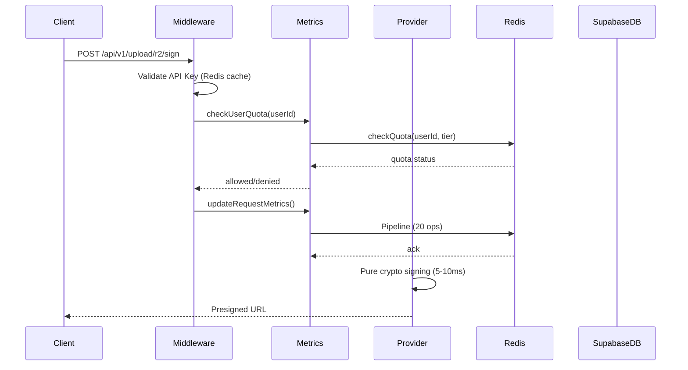

# ObitoX API - Complete Architecture Analysis

## Executive Summary

The ObitoX API is a **multi-provider file storage management platform** that provides unified access to Cloudflare R2, AWS S3, Supabase Storage, and Uploadcare. The system is built with a **layered security architecture** and **aggressive performance optimizations** (Redis caching, pure cryptographic signing).

---

## 1. System Architecture Overview

```mermaid
flowchart TB
    subgraph "Client Layer"
        SDK[ObitoX SDK - src/]
        Direct[Direct API Calls]
    end

    subgraph "API Gateway Layer"
        Routes[Express Routes]
        Middlewares[Middlewares]
    end

    subgraph "Security Layer"
        APIKey[API Key Validation]
        RateLimiter[Rate Limiting]
        Signature[Request Signatures]
        Arcjet[Bot Protection]
    end

    subgraph "Controller Layer - CORE"
        Analytics[Analytics Controller]
        APIKey[API Key Controller]
        Providers[Provider Controllers]
    end

    subgraph "Provider Layer"
        R2[Cloudflare R2]
        S3[AWS S3]
        Supabase[Supabase Storage]
        Uploadcare[Uploadcare CDN]
    end

    subgraph "Data Layer"
        Redis[(Redis Cache)]
        SupabaseDB[(Supabase DB)]
    end

    SDK --> Routes
    Direct --> Routes
    Routes --> Middlewares
    Middlewares --> Security Layer
    Security Layer --> Controller Layer
    Controller Layer --> Provider Layer
    Controller Layer --> Redis
    Controller Layer --> SupabaseDB
```

---

## 2. Controllers Deep Analysis

### 2.1 Root Controllers

#### [`controllers/analytics.controller.js`](controllers/analytics.controller.js)
**Purpose:** Provides comprehensive analytics and usage metrics

**Endpoints:**
- `getUploadAnalytics` - Get running totals and provider breakdown
- `getDailyUsageAnalytics` - Get daily usage snapshots
- `getProviderUsageAnalytics` - Get per-provider detailed analytics
- `getFileTypeAnalytics` - Get file type distribution

**Key Features:**
- 60-second Redis cache for frequently accessed data
- Cache-Control headers for browser/CDN caching
- Aggregates data from:
  - `api_keys` table (running totals)
  - `provider_usage` table (per-provider running totals)
  - `api_key_usage_daily` table (daily snapshots)
  - `provider_usage_daily` table (per-provider daily snapshots)

**Database Tables Used:**
```
- api_keys: total_requests, successful_requests, failed_requests, 
           total_file_size, total_files_uploaded, file_type_counts
- provider_usage: provider, upload_count, total_file_size, last_used_at
- api_key_usage_daily: daily snapshots by date
- provider_usage_daily: daily snapshots by provider
```

#### [`controllers/apikey.controller.js`](controllers/apikey.controller.js)
**Purpose:** API key validation and user/plan information retrieval

**Key Functions:**
- `validateApiKey` - Validates API key from header or query param
- `validateApiKeyPost` - POST version for testing

**Validation Steps:**
1. Extract API key from header/query
2. Validate format (`ox_` prefix, min 10 chars)
3. Query `api_keys` table for key existence
4. Update `last_used_at` timestamp
5. Fetch user info via Supabase Auth Admin
6. Fetch subscription tier from `profiles_with_tier` view
7. Fetch provider usage stats from `provider_usage` table
8. Return comprehensive response with plan limits

**Response Includes:**
- API key metadata (requests, file size, success rate)
- User info (email, name from metadata)
- Subscription plan/tier
- Provider usage breakdown

---

### 2.2 Provider Controllers Architecture

Each provider follows a **modular architecture** with these common patterns:

```
controllers/providers/{provider}/
├── index.js              # Main export hub
├── {provider}.config.js  # Configuration, limits, validations
├── {provider}.signed-url.js    # Generate presigned URLs
├── {provider}.delete.js         # File deletion
├── {provider}.download.js       # Download operations
├── {provider}.list.js           # List files
├── {provider}.helpers.js        # Shared utilities
└── cache/
    ├── memory-guard.js   # In-memory rate limiting
    └── redis-cache.js    # Redis caching layer
```

---

## 3. Provider Deep Dive

### 3.1 Cloudflare R2 ([`controllers/providers/r2/`](controllers/providers/r2/))

**Architecture:** Pure cryptographic signing (NO external API calls)

**Performance Target:** 5-15ms P95 response time

**Key Files:**
| File | Purpose |
|------|---------|
| [`r2.signed-url.js`](controllers/providers/r2/r2.signed-url.js) | Generate presigned PUT URLs |
| [`r2.download-url.js`](controllers/providers/r2/r2.download-url.js) | Time-limited download URLs |
| [`r2.batch-signed-url.js`](controllers/providers/r2/r2.batch-signed-url.js) | Batch URL generation (up to 100) |
| [`r2.batch-delete.js`](controllers/providers/r2/r2.batch-delete.js) | Batch deletion |
| [`r2.access-token.js`](controllers/providers/r2/r2.access-token.js) | JWT access tokens |
| [`r2.config.js`](controllers/providers/r2/r2.config.js) | Configuration & validation |

**Signed URL Flow:**
```
Request → Memory Guard (0-2ms) → Quota Check → Validation → Pure Crypto Sign → Response
```

**Configuration:**
- Max file size: 5GB
- Default expiry: 1 hour (max 7 days)
- Rate limits: 100/min, 5000/hour

**Advanced Features:**
- ✅ Batch signed URLs (Phase 2B)
- ✅ Batch delete (Phase 2B)
- ✅ Time-limited download URLs (Phase 2A)
- ✅ JWT access tokens (Phase 2A)

---

### 3.2 AWS S3 ([`controllers/providers/s3/`](controllers/providers/s3/))

**Architecture:** AWS SDK v3 cryptographic signing (zero external calls)

**Performance Target:** 7-15ms response time

**Key Files:**
| File | Purpose |
|------|---------|
| [`s3.signed-url.js`](controllers/providers/s3/s3.signed-url.js) | Generate presigned URLs |
| [`s3.multipart.js`](controllers/providers/s3/s3.multipart.js) | Multipart upload (files >100MB) |
| [`s3.download.js`](controllers/providers/s3/s3.download.js) | Generate download URLs |
| [`s3.delete.js`](controllers/providers/s3/s3.delete.js) | Delete files |
| [`s3.list.js`](controllers/providers/s3/s3.list.js) | List objects |
| [`s3.metadata.js`](controllers/providers/s3/s3.metadata.js) | Get object metadata |

**Unique Features:**
- Multi-region support (validated via `utils/aws/s3-regions.js`)
- Storage class selection (STANDARD, INTELLIGENT_TIERING, GLACIER, etc.)
- Server-side encryption (SSE-S3, SSE-KMS)
- Multipart uploads for large files

---

### 3.3 Supabase Storage ([`controllers/providers/supabase/`](controllers/providers/supabase/))

**Architecture:** Direct Supabase SDK integration with multi-layer caching

**Performance Target:** <200ms response time

**Key Files:**
| File | Purpose |
|------|---------|
| [`supabase.signed-url.js`](controllers/providers/supabase/supabase.signed-url.js) | Generate signed URLs |
| [`supabase.upload.js`](controllers/providers/supabase/supabase.upload.js) | Direct upload handling |
| [`supabase.delete.js`](controllers/providers/supabase/supabase.delete.js) | Delete files |
| [`supabase.download.js`](controllers/providers/supabase/supabase.download.js) | Generate signed download URLs |
| [`supabase.buckets.js`](controllers/providers/supabase/supabase.buckets.js) | List buckets |

**Caching Layers:**
1. **Memory Guard** - In-memory rate limiting (0-5ms)
2. **Redis Cache** - Rate limits & bucket access (5-50ms)
3. **Supabase DB** - Authoritative data

---

### 3.4 Uploadcare ([`controllers/providers/uploadcare/`](controllers/providers/uploadcare/))

**Architecture:** Enterprise CDN with malware scanning

**Key Files:**
| File | Purpose |
|------|---------|
| [`uploadcare.signed-url.js`](controllers/providers/uploadcare/uploadcare.signed-url.js) | Generate upload tokens |
| [`uploadcare.malware.js`](controllers/providers/uploadcare/uploadcare.malware.js) | Malware scanning |
| [`uploadcare.validation.js`](controllers/providers/uploadcare/uploadcare.validation.js) | File validation |
| [`uploadcare.health.js`](controllers/providers/uploadcare/uploadcare.health.js) | Health checks |

**Enterprise Features:**
- ✅ Malware scanning (Phase 5)
- ✅ SVG validation/security
- ✅ Image optimization metadata
- ✅ CDN-based delivery

---

## 4. Security Architecture

### 4.1 Layer 1: API Key Authentication

**Middleware:** [`middlewares/apikey.middleware.optimized.js`](middlewares/apikey.middleware.optimized.js)

**Flow:**
```
1. Extract API key from header/query
2. Redis cache lookup (5-minute TTL)
3. Cache miss → Supabase DB lookup
4. Validate key format (ox_xxxxxxxx...)
5. Check expiration
6. Attach user data to request
```

**Performance:**
- Cache HIT: ~2-5ms
- Cache MISS: ~80-100ms
- Expected hit rate: 80-95%

### 4.2 Layer 2: Request Signatures (Optional)

**Middleware:** [`middlewares/signature-validator.middleware.js`](middlewares/signature-validator.middleware.js)

**Purpose:** HMAC-SHA256 request signing for enhanced security

**SDK Implementation:** [`src/client.ts`](src/client.ts:444-462)
```typescript
private async generateSignature(method, path, timestamp, body) {
    const message = `${method.toUpperCase()}|${path}|${timestamp}|${bodyString}`;
    const hmac = createHmac('sha256', this.apiSecret!);
    hmac.update(message);
    return hmac.digest('hex');
}
```

### 4.3 Layer 3: Rate Limiting

**Middleware:** [`middlewares/rate-limiter.middleware.js`](middlewares/rate-limiter.middleware.js)

**Architecture:**
1. **Memory Guard** - In-memory for instant rejection
2. **Redis** - Distributed rate limiting
3. **Supabase** - Quota enforcement

### 4.4 Layer 4: Bot Protection

**Middleware:** [`middlewares/arcjet.middleware.js`](middlewares/arcjet.middleware.js)

**Features:**
- Bot detection
- Rate limiting
- IP blocking

---

## 5. Metrics & Analytics System

### 5.1 Redis-Backed Metrics ([`controllers/providers/shared/metrics.helper.js`](controllers/providers/shared/metrics.helper.js))

**Architecture:** Single pipeline, atomic operations, graceful degradation

**Metrics Tracked:**
1. **API Key Real-time Metrics**
   - `total_requests`
   - `successful_requests`
   - `failed_requests`
   - `total_file_size`
   - `total_files_uploaded`

2. **Provider Real-time Metrics**
   - Per-provider upload counts
   - File size aggregation
   - Last used timestamps

3. **User Daily Metrics**
   - Daily request counts
   - Daily file sizes
   - Usage by provider

**Performance:**
- ~20 Redis ops per request in single pipeline
- ~2-5ms latency (local Redis)
- ~10-20ms latency (Redis Cloud)
- Zero user-facing impact if Redis fails

### 5.2 Quota Management ([`utils/quota-manager.js`](utils/quota-manager.js))

**Monthly Quotas:**
| Tier | Requests/Month |
|------|----------------|
| Free | 1,000 |
| Pro | 50,000 |
| Enterprise | Unlimited |

**Flow:**
```
Request → getUserTierCached() → checkQuota() → incrementQuota()
         (~1-5ms)             (~1-5ms)       (~1-5ms)
```

---

## 6. Data Flow: Request Lifecycle

### Typical Signed URL Request Flow



---

## 7. All Identified Providers

| Provider | Type | Performance | Key Features |
|----------|------|-------------|--------------|
| **Cloudflare R2** | S3-compatible | 5-15ms | Batch ops, pure crypto, no egress fees |
| **AWS S3** | S3-compatible | 7-15ms | Multi-region, storage classes, KMS |
| **Supabase** | Native | <200ms | Auth integration, buckets |
| **Uploadcare** | CDN | Varies | Malware scan, CDN, optimization |

---

## 8. Key Optimization Patterns

### 8.1 Pure Cryptographic Signing
R2 and S3 use **zero external API calls** for signing:
```javascript
// No API call to validate credentials
// No API call to generate signature
// Let the storage provider validate at upload time
```

### 8.2 Multi-Layer Caching
```
Request → Memory (0-5ms) → Redis (1-5ms) → DB (50-100ms)
   ↓
Reject early if rate limited
```

### 8.3 Atomic Pipeline Operations
```javascript
const pipeline = redis.pipeline();
pipeline.hincrby(apiKeyKey, 'total_requests', 1);
pipeline.hincrby(apiKeyKey, 'successful_requests', 1);
pipeline.hset(apiKeyKey, 'last_used_at', now);
pipeline.expire(apiKeyKey, METRICS_TTL);
await pipeline.exec(); // Single round-trip
```

### 8.4 Graceful Degradation
All systems fail-open to prevent user-facing errors:
```javascript
try {
    await updateRequestMetrics(...);
} catch (error) {
    // Log but don't fail the request
    console.warn('Metrics update failed:', error);
}
```

---

## 9. Database Schema Overview

### Core Tables
| Table | Purpose |
|-------|---------|
| `api_keys` | API key metadata & running totals |
| `provider_usage` | Per-provider running totals |
| `api_key_usage_daily` | Daily snapshots |
| `provider_usage_daily` | Per-provider daily snapshots |
| `profiles_with_tier` | View with computed subscription tier |

### Key Columns in `api_keys`
- `id` - UUID primary key
- `key_value` - The actual API key (ox_...)
- `user_id` - Owner UUID
- `total_requests` - Running request count
- `successful_requests` - Successful uploads
- `failed_requests` - Failed requests
- `total_file_size` - Total bytes uploaded
- `total_files_uploaded` - Total file count
- `file_type_counts` - JSON object with MIME type counts

---

## 10. Routes & Endpoints

### [`routes/upload.routes.js`](routes/upload.routes.js)
| Endpoint | Method | Provider | Purpose |
|----------|--------|----------|---------|
| `/api/v1/upload/r2/sign` | POST | R2 | Generate presigned URL |
| `/api/v1/upload/r2/batch-sign` | POST | R2 | Batch URL generation |
| `/api/v1/upload/r2/delete` | POST | R2 | Delete file |
| `/api/v1/upload/r2/download` | POST | R2 | Generate download URL |
| `/api/v1/upload/s3/sign` | POST | S3 | Generate presigned URL |
| `/api/v1/upload/s3/multipart/*` | POST | S3 | Multipart upload |
| `/api/v1/upload/supabase/sign` | POST | Supabase | Generate signed URL |
| `/api/v1/upload/supabase/upload` | POST | Supabase | Direct upload |
| `/api/v1/upload/uploadcare/sign` | POST | Uploadcare | Generate upload token |
| `/api/v1/upload/uploadcare/scan` | POST | Uploadcare | Malware scan |

### [`routes/apikey.routes.js`](routes/apikey.routes.js)
| Endpoint | Method | Purpose |
|----------|--------|---------|
| `/api/v1/upload/validate` | GET/POST | Validate API key |

### [`routes/analytics.routes.js`](routes/analytics.routes.js)
| Endpoint | Method | Purpose |
|----------|--------|---------|
| `/api/v1/analytics/uploads` | GET | Upload analytics |
| `/api/v1/analytics/daily` | GET | Daily usage |
| `/api/v1/analytics/providers` | GET | Provider breakdown |
| `/api/v1/analytics/filetypes` | GET | File type distribution |

---

## 11. Configuration Files

### Redis ([`config/redis.js`](config/redis.js))
- Connection pooling
- Cache TTL configuration
- Pipeline support

### Supabase ([`config/supabase.js`](config/supabase.js))
- Admin client for privileged operations
- Service role for backend operations

### Environment ([`config/env.js`](config/env.js))
- Environment variable loading
- Validation

---

## 12. Background Jobs ([`jobs/`](jobs/))

| Job | Purpose |
|-----|---------|
| `daily-rollup-worker.js` | Sync Redis metrics to DB daily |
| `metrics-worker.js` | Aggregate metrics |
| `audit-worker.js` | Process audit logs |
| `sync-quotas.js` | Sync quota data |

---

## 13. Summary: Core Heart of the System

The **core logic** resides in these key areas:

1. **Controller Layer** ([`controllers/`](controllers/))
   - [`analytics.controller.js`](controllers/analytics.controller.js) - Metrics & reporting
   - [`apikey.controller.js`](controllers/apikey.controller.js) - Authentication

2. **Provider Controllers** - Modular per-provider logic
   - R2: Pure crypto, fastest (~5ms)
   - S3: AWS SDK, flexible (~7ms)
   - Supabase: Native SDK, auth-integrated (~50ms)
   - Uploadcare: CDN + malware scanning (~100ms)

3. **Shared Helpers** ([`controllers/providers/shared/`](controllers/providers/shared/))
   - [`metrics.helper.js`](controllers/providers/shared/metrics.helper.js) - Redis-backed metrics
   - [`analytics.new.js`](controllers/providers/shared/analytics.new.js) - Quota checking
   - [`validation.helper.js`](controllers/providers/shared/validation.helper.js) - Input validation

4. **Security Layer** (Middlewares)
   - API key validation with Redis caching
   - Rate limiting (memory + Redis)
   - Request signatures (Layer 2)

**The architecture prioritizes:**
- ✅ Performance (5-15ms for R2/S3)
- ✅ Scalability (Redis-backed everything)
- ✅ Security (multi-layer)
- ✅ Maintainability (modular per-provider)
