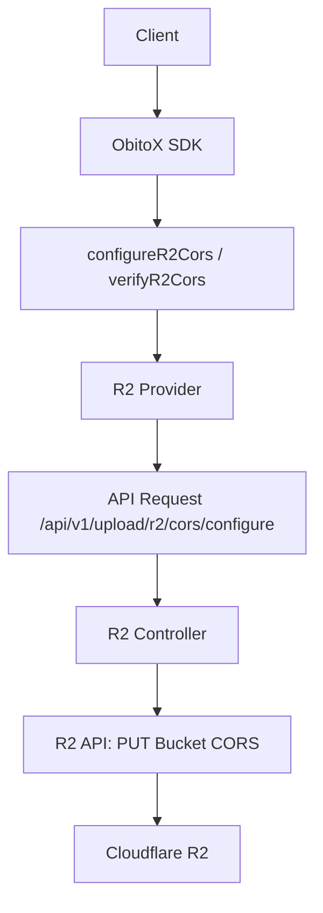

# R2 CORS Auto-Configuration Implementation Plan

## Overview

Add CORS auto-configuration support to Cloudflare R2 storage provider. Since R2 is S3-compatible (~90% API compatibility), we can reuse most of the S3 CORS implementation with minimal modifications.

## Why R2 is S3-Compatible

- Same S3 API endpoints (GET, PUT, DELETE, etc.)
- Same authentication (AWS Signature v4)
- Same bucket/object structure
- Same CORS configuration mechanism (`PUT Bucket cors`)

## Files to Modify/Create

### 1. Backend Controllers (90% copy-paste)

| Source File | Target File | Changes Needed |
|-------------|-------------|----------------|
| `controllers/providers/s3/s3.config.js` | `controllers/providers/r2/r2.config.js` | Replace S3 API calls with R2 API calls, update endpoint URL |

### 2. SDK Types (100% copy-paste + rename)

| Source File | Target File | Changes Needed |
|-------------|-------------|----------------|
| `src/types/s3.types.ts` | `src/types/r2.types.ts` | Copy all CORS types, rename S3→R2 |

### 3. SDK Provider (90% copy-paste)

| Source File | Target File | Changes Needed |
|-------------|-------------|----------------|
| `src/providers/s3/s3.provider.ts` | `src/providers/r2/r2.provider.ts` | Copy CORS methods, rename S3→R2 |

### 4. Main Client (minimal changes)

| File | Changes Needed |
|------|----------------|
| `src/client.ts` | Add `configureR2Cors()` and `verifyR2Cors()` methods |

### 5. Route Endpoints (90% copy-paste)

| Source File | Target File | Changes Needed |
|-------------|-------------|----------------|
| `routes/upload.routes.js` | Add R2 CORS routes | Copy S3 CORS routes, rename to R2 |

## Implementation Steps

### Step 1: Copy S3 CORS Types to R2 Types

**File:** `src/types/r2.types.ts`

Copy these interfaces and rename:
- `S3CorsConfigOptions` → `R2CorsConfigOptions`
- `S3CorsConfigResponse` → `R2CorsConfigResponse`
- `S3CorsVerifyOptions` → `R2CorsVerifyOptions`
- `S3CorsVerifyResponse` → `R2CorsVerifyResponse`

```typescript
// R2 CORS Configuration Options
export interface R2CorsConfigOptions {
    r2AccessKey: string;      // Changed from s3AccessKey
    r2SecretKey: string;      // Changed from s3SecretKey
    r2Bucket: string;         // Changed from s3Bucket
    r2AccountId: string;      // NEW: Cloudflare account ID
    r2Endpoint?: string;       // NEW: Custom R2 endpoint
    allowedOrigins?: string[];
    allowedMethods?: string[];
    allowedHeaders?: string[];
    maxAgeSeconds?: number;
    exposeHeaders?: string[];
    optionsSuccessStatus?: number;
}
```

### Step 2: Create R2 Config Controller

**File:** `controllers/providers/r2/r2.config.js`

Key differences from S3:
1. R2 uses `https://<accountId>.r2.cloudflarestorage.com` endpoint
2. R2 requires `Authorization` header with AWS Signature v4
3. R2 CORS XML format (same as S3)

```javascript
// R2 CORS Configuration Endpoint
router.post('/api/v1/upload/r2/cors/configure', async (req, res) => {
    const { r2AccessKey, r2SecretKey, r2Bucket, r2AccountId, r2Endpoint, ...corsOptions } = req.body;
    
    // Build R2 endpoint
    const endpoint = r2Endpoint || `https://${r2AccountId}.r2.cloudflarestorage.com`;
    
    // Build CORS XML (same as S3)
    const corsXml = buildCorsXml(corsOptions);
    
    // Call R2 API: PUT Bucket CORS
    await r2Client.putBucketCors({
        Bucket: r2Bucket,
        CORSConfiguration: {
            CORSRules: [{
                AllowedHeaders: corsOptions.allowedHeaders || ['*'],
                AllowedMethods: corsOptions.allowedMethods || ['GET', 'PUT', 'POST', 'DELETE', 'HEAD'],
                AllowedOrigins: corsOptions.allowedOrigins || ['*'],
                ExposeHeaders: corsOptions.exposeHeaders || [],
                MaxAgeSeconds: corsOptions.maxAgeSeconds || 3600
            }]
        }
    });
    
    res.json({ success: true, message: 'R2 CORS configured' });
});
```

### Step 3: Add CORS Methods to R2 Provider

**File:** `src/providers/r2/r2.provider.ts`

Copy from `src/providers/s3/s3.provider.ts`:
- `configureCors()` method → `configureCors()`
- `verifyCors()` method → `verifyCors()`

Changes:
- Rename `s3AccessKey` → `r2AccessKey`
- Rename `s3SecretKey` → `r2SecretKey`
- Rename `s3Bucket` → `r2Bucket`
- Add `r2AccountId` parameter
- Add `r2Endpoint` parameter (optional)

### Step 4: Update R2 Types Export

**File:** `src/types/index.ts`

Add exports:
```typescript
export type {
    R2CorsConfigOptions,
    R2CorsConfigResponse,
    R2CorsVerifyOptions,
    R2CorsVerifyResponse,
} from './r2.types.js';
```

### Step 5: Add Client Convenience Methods

**File:** `src/client.ts`

```typescript
/**
 * Configure CORS on an R2 bucket
 */
async configureR2Cors(options: R2CorsConfigOptions): Promise<R2CorsConfigResponse> {
    const provider = this.providers.get('R2');
    if (!provider) {
        throw new Error('R2 provider is not available');
    }
    return (provider as R2Provider).configureCors(options);
}

/**
 * Verify CORS configuration on an R2 bucket
 */
async verifyR2Cors(options: R2CorsVerifyOptions): Promise<R2CorsVerifyResponse> {
    const provider = this.providers.get('R2');
    if (!provider) {
        throw new Error('R2 provider is not available');
    }
    return (provider as R2Provider).verifyCors(options);
}
```

### Step 6: Add Route Endpoints

**File:** `routes/upload.routes.js`

```javascript
// R2 CORS routes
router.post('/api/v1/upload/r2/cors/configure', r2CorsController.configureCors);
router.post('/api/v1/upload/r2/cors/verify', r2CorsController.verifyCors);
```

## Key Differences: S3 vs R2 CORS

| Aspect | S3 | R2 |
|--------|-----|-----|
| Endpoint | `s3.<region>.amazonaws.com` | `<accountId>.r2.cloudflarestorage.com` |
| Authentication | AWS Signature v4 | AWS Signature v4 (compatible) |
| CORS XML | Same | Same |
| Required Params | accessKey, secretKey, bucket | accessKey, secretKey, bucket, accountId |
| Pricing | Request charges | No egress charges |

## Testing

Create test file: `test/sdk/test-r2-cors.js`

```javascript
import ObitoX from '../src/client.js';

const client = new ObitoX({ apiKey: 'ox_xxx...' });

// Configure CORS on R2 bucket
await client.configureR2Cors({
    r2AccessKey: 'accessKeyId',
    r2SecretKey: 'secretAccessKey',
    r2Bucket: 'my-bucket',
    r2AccountId: 'abc123',
    allowedOrigins: ['https://myapp.com']
});

// Verify CORS configuration
const result = await client.verifyR2Cors({
    r2AccessKey: 'accessKeyId',
    r2SecretKey: 'secretAccessKey',
    r2Bucket: 'my-bucket',
    r2AccountId: 'abc123'
});

console.log(result.isValid ? 'CORS configured!' : 'Issues found:', result.issues);
```

## Effort Estimate

| Task | Effort | Reason |
|------|--------|--------|
| Copy types | 15 min | 100% copy-paste |
| Create controller | 30 min | 90% copy-paste, need R2 API specifics |
| Add provider methods | 20 min | 90% copy-paste |
| Update client | 10 min | Minimal changes |
| Add routes | 10 min | Copy-paste |
| Testing | 30 min | Similar to S3 |
| **Total** | **~2 hours** | Mostly copy-paste with R2-specific tweaks |

## Architecture Diagram



## References

- [R2 CORS Documentation](https://developers.cloudflare.com/r2/data-access/s3-api/api/)
- [S3 CORS API](https://docs.aws.amazon.com/AmazonS3/latest/userguide/cors.html)
- [AWS Signature v4 for R2](https://developers.cloudflare.com/r2/data-access/s3-api/authentication/)
