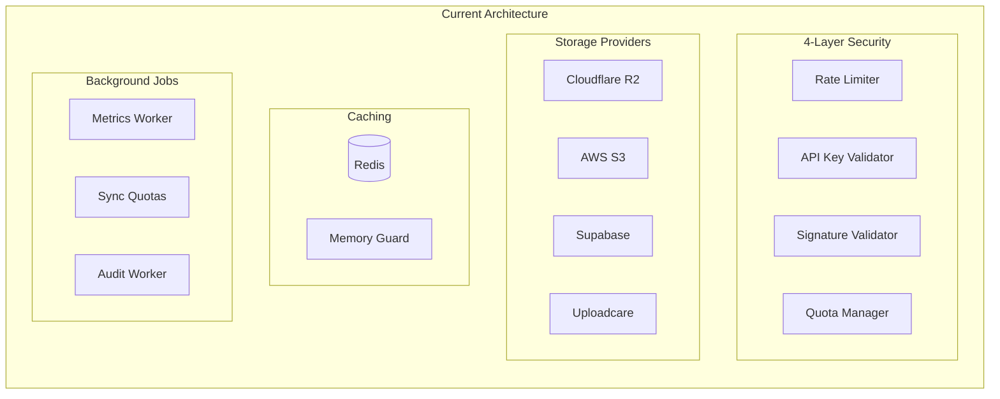
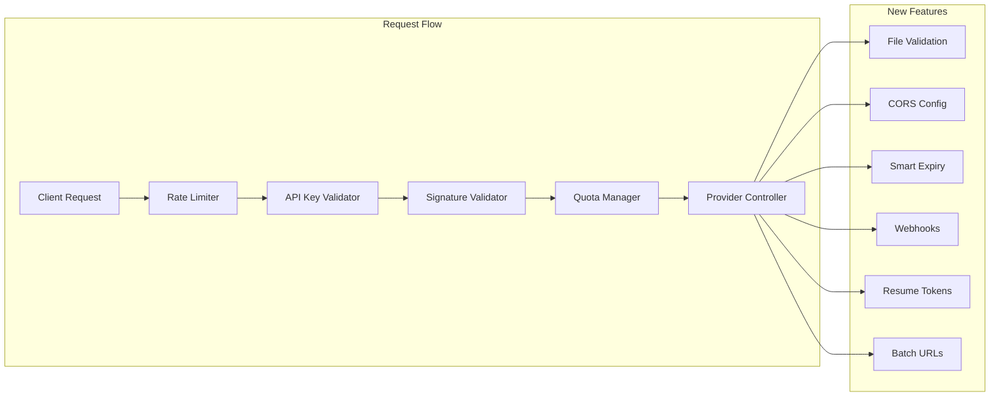

# Tier 1 Implementation Plan - ObitoX API

## Executive Summary

After thorough analysis of the existing ObitoX architecture and the proposed Tier 1 features from `painfull.md`, `tire1-1.md`, and `tire1-2.md`, I've determined that **the proposed features align exceptionally well with the existing architecture**. The current system already has the infrastructure to support these features with minimal modifications.

### Architecture Alignment Score: 9/10

The existing architecture provides:
- ✅ Modular provider system (easy to extend)
- ✅ Multi-layer middleware stack (validation fits naturally)
- ✅ Redis-based caching and metrics
- ✅ Existing S3/R2 providers with presigned URL generation
- ✅ Background job workers for async processing
- ✅ Comprehensive quota and rate limiting

---

## Current State Analysis

### Existing Infrastructure (Strengths)



### What's Already Implemented

1. **File Validation (Partial)**
   - ✅ Basic filename sanitization in `filename.helper.js`
   - ✅ File size validation in provider configs
   - ❌ Magic bytes validation (MISSING)
   - ❌ MIME type spoofing protection (MISSING)

2. **CORS Handling (Minimal)**
   - ❌ No CORS auto-configuration (MISSING)
   - ❌ No CORS verification (MISSING)
   - ✅ S3 client supports custom endpoints

3. **Smart Expiry (Not Implemented)**
   - ❌ Static expiry times only
   - ❌ No network-aware calculations

---

## Proposed Tier 1 Features

### Feature Priority Matrix

| Feature | Pain Level | Implementation Effort | Business Value | Priority |
|---------|-----------|----------------------|----------------|----------|
| File Validation (Magic Bytes) | 🔴 Critical | Low | High | P0 |
| CORS Auto-Configuration | 🔴 Critical | Medium | Very High | P0 |
| Smart Presigned URL Expiry | 🔴 High | Low | High | P1 |
| Upload Completion Webhooks | 🔴 High | Medium | High | P1 |
| Resumable Multipart Uploads | 🔴 Critical | High | Very High | P2 |
| Batch Presigned URLs | 🟡 Medium | Low | Medium | P2 |

---

## Implementation Plan

### Phase 1: File Validation (Magic Bytes) - P0

**Objective**: Add client-side and server-side file validation using magic bytes to prevent MIME type spoofing attacks.

#### 1.1 Create Validation Utilities

**New File**: `controllers/providers/shared/file-validation.helper.js`

```javascript
/**
 * File Validation Helper
 * Prevents MIME type spoofing by checking magic bytes
 */

export const MAGIC_BYTES_MAP = {
  // Images
  jpeg: { bytes: [0xFF, 0xD8, 0xFF], mimeType: 'image/jpeg' },
  png: { bytes: [0x89, 0x50, 0x4E, 0x47, 0x0D, 0x0A, 0x1A, 0x0A], mimeType: 'image/png' },
  gif: { bytes: [0x47, 0x49, 0x46, 0x38], mimeType: 'image/gif' },
  webp: { bytes: [0x52, 0x49, 0x46, 0x46], mimeType: 'image/webp' },
  
  // Documents
  pdf: { bytes: [0x25, 0x50, 0x44, 0x46], mimeType: 'application/pdf' },
  zip: { bytes: [0x50, 0x4B, 0x03, 0x04], mimeType: 'application/zip' },
  
  // Videos
  mp4: { bytes: [0x00, 0x00, 0x00, 0x18, 0x66, 0x74, 0x79, 0x70], mimeType: 'video/mp4' },
  webm: { bytes: [0x1A, 0x45, 0xDF, 0xA3], mimeType: 'video/webm' },
  
  // Audio
  mp3: { bytes: [0x49, 0x44, 0x33], mimeType: 'audio/mpeg' },
  wav: { bytes: [0x52, 0x49, 0x46, 0x46], mimeType: 'audio/wav' },
};

export const DANGEROUS_EXTENSIONS = [
  'exe', 'dll', 'bat', 'cmd', 'sh', 'bash', 'ps1', 'vbs', 'js', 'jar',
  'app', 'deb', 'rpm', 'dmg', 'pkg', 'msi', 'scr', 'com', 'pif'
];

export class FileValidationError extends Error {
  constructor(message, code, details = {}) {
    super(message);
    this.name = 'FileValidationError';
    this.code = code;
    this.details = details;
  }
}

/**
 * Detect real MIME type by reading magic bytes
 * @param {Buffer} buffer - First 8 bytes of file
 * @returns {string} Detected MIME type
 */
export function detectRealMimeType(buffer) {
  const bytes = Array.from(buffer.slice(0, 8));
  
  for (const [ext, signature] of Object.entries(MAGIC_BYTES_MAP)) {
    if (signature.bytes.length === 0) continue;
    
    const matches = signature.bytes.every((byte, index) => bytes[index] === byte);
    if (matches) {
      return signature.mimeType;
    }
  }
  
  return 'application/octet-stream';
}

/**
 * Validate file on server-side
 * @param {Object} options - Validation options
 * @param {number} options.fileSize - File size in bytes
 * @param {string} options.declaredMimeType - Declared MIME type
 * @param {Buffer} options.fileBuffer - First 8 bytes of file
 * @param {string} options.filename - Original filename
 * @param {Object} options.validation - Validation rules
 */
export function validateFileServerSide(options) {
  const { fileSize, declaredMimeType, fileBuffer, filename, validation = {} } = options;
  
  const errors = [];
  
  // 1. Size validation
  if (validation.maxSizeMB && fileSize > validation.maxSizeMB * 1024 * 1024) {
    errors.push({
      code: 'FILE_TOO_LARGE',
      message: `File size ${(fileSize / 1024 / 1024).toFixed(2)}MB exceeds maximum ${validation.maxSizeMB}MB`,
      details: { fileSize, maxSizeMB: validation.maxSizeMB }
    });
  }
  
  if (validation.minSizeKB && fileSize < validation.minSizeKB * 1024) {
    errors.push({
      code: 'FILE_TOO_SMALL',
      message: `File size ${(fileSize / 1024).toFixed(2)}KB is below minimum ${validation.minSizeKB}KB`,
      details: { fileSize, minSizeKB: validation.minSizeKB }
    });
  }
  
  // 2. Extension validation
  const extension = filename.split('.').pop()?.toLowerCase();
  if (validation.allowedExtensions && !validation.allowedExtensions.includes(extension)) {
    errors.push({
      code: 'INVALID_EXTENSION',
      message: `File extension ".${extension}" not allowed`,
      details: { extension, allowedExtensions: validation.allowedExtensions }
    });
  }
  
  // 3. Block dangerous executables
  if (validation.blockExecutables !== false && DANGEROUS_EXTENSIONS.includes(extension)) {
    errors.push({
      code: 'DANGEROUS_FILE_TYPE',
      message: `Executable files (.${extension}) are not allowed for security reasons`,
      details: { extension }
    });
  }
  
  // 4. Magic bytes validation (CRITICAL - prevents spoofing)
  if (validation.allowedTypes && fileBuffer) {
    const detectedMimeType = detectRealMimeType(fileBuffer);
    
    if (!validation.allowedTypes.includes(detectedMimeType)) {
      errors.push({
        code: 'MIME_TYPE_MISMATCH',
        message: `File type mismatch. Detected: ${detectedMimeType}, Declared: ${declaredMimeType}`,
        details: { detectedMimeType, declaredMimeType, allowedTypes: validation.allowedTypes }
      });
    }
  }
  
  if (errors.length > 0) {
    throw new FileValidationError(
      `File validation failed: ${errors.map(e => e.message).join(', ')}`,
      'VALIDATION_FAILED',
      { errors }
    );
  }
  
  return { valid: true, detectedMimeType: detectRealMimeType(fileBuffer) };
}
```

#### 1.2 Integrate into S3 Provider

**Modify**: `controllers/providers/s3/s3.signed-url.js`

Add validation before generating presigned URL:

```javascript
import { validateFileServerSide, FileValidationError } from '../shared/file-validation.helper.js';

export const generateS3SignedUrl = async (req, res) => {
  // ... existing code ...
  
  const { filename, contentType, fileSize, fileBuffer, validation } = req.body;
  
  // Validate file if validation rules provided
  if (validation) {
    try {
      validateFileServerSide({
        fileSize,
        declaredMimeType: contentType,
        fileBuffer: fileBuffer ? Buffer.from(fileBuffer, 'base64') : null,
        filename,
        validation
      });
    } catch (error) {
      if (error instanceof FileValidationError) {
        return res.status(400).json({
          success: false,
          error: error.code,
          message: error.message,
          details: error.details
        });
      }
      throw error;
    }
  }
  
  // ... continue with existing presigned URL generation ...
};
```

#### 1.3 Add SDK-Side Validation (TypeScript)

**New File**: `src/utils/file-validator.ts`

```typescript
import { MAGIC_BYTES_MAP, DANGEROUS_EXTENSIONS, FileValidationError } from './file-validation.types';

export interface FileValidationOptions {
  maxSizeMB?: number;
  minSizeKB?: number;
  allowedTypes?: string[];
  allowedExtensions?: string[];
  sanitizeFilename?: boolean;
  blockExecutables?: boolean;
}

export async function validateFile(
  file: File | Blob,
  options: FileValidationOptions = {}
): Promise<{ valid: true; detectedMimeType: string; sanitizedFilename?: string }> {
  const filename = file instanceof File ? file.name : 'blob';
  const extension = filename.split('.').pop()?.toLowerCase() || '';
  
  // 1. Size checks
  if (options.maxSizeMB && file.size > options.maxSizeMB * 1024 * 1024) {
    throw new FileValidationError(
      `File too large: ${(file.size / 1024 / 1024).toFixed(2)}MB. Max: ${options.maxSizeMB}MB`,
      'FILE_TOO_LARGE',
      { fileSize: file.size, maxSizeMB: options.maxSizeMB }
    );
  }
  
  if (options.minSizeKB && file.size < options.minSizeKB * 1024) {
    throw new FileValidationError(
      `File too small: ${(file.size / 1024).toFixed(2)}KB. Min: ${options.minSizeKB}KB`,
      'FILE_TOO_SMALL',
      { fileSize: file.size, minSizeKB: options.minSizeKB }
    );
  }
  
  // 2. Block executables
  if (options.blockExecutables !== false && DANGEROUS_EXTENSIONS.includes(extension)) {
    throw new FileValidationError(
      `Dangerous file type: .${extension} files are not allowed`,
      'DANGEROUS_FILE_TYPE',
      { extension }
    );
  }
  
  // 3. Extension whitelist
  if (options.allowedExtensions && !options.allowedExtensions.includes(extension)) {
    throw new FileValidationError(
      `Extension ".${extension}" not allowed. Allowed: ${options.allowedExtensions.join(', ')}`,
      'INVALID_EXTENSION',
      { extension, allowedExtensions: options.allowedExtensions }
    );
  }
  
  // 4. Magic bytes validation
  let detectedMimeType = 'application/octet-stream';
  if (options.allowedTypes) {
    const slice = file.slice(0, 8);
    const arrayBuffer = await slice.arrayBuffer();
    const bytes = new Uint8Array(arrayBuffer);
    
    for (const [, signature] of Object.entries(MAGIC_BYTES_MAP)) {
      if (signature.bytes.length === 0) continue;
      
      const matches = signature.bytes.every((byte, index) => bytes[index] === byte);
      if (matches) {
        detectedMimeType = signature.mimeType;
        break;
      }
    }
    
    if (!options.allowedTypes.includes(detectedMimeType)) {
      throw new FileValidationError(
        `Invalid file type. Detected: "${detectedMimeType}", Allowed: ${options.allowedTypes.join(', ')}`,
        'INVALID_MIME_TYPE',
        { detectedMimeType, declaredType: file instanceof File ? file.type : 'unknown' }
      );
    }
  }
  
  return { valid: true, detectedMimeType };
}
```

#### 1.4 API Route Updates

**Modify**: `routes/upload.routes.js`

Add validation endpoint:

```javascript
// File validation endpoint (client can pre-validate)
router.post('/validate-file', validateApiKey, unifiedRateLimitMiddleware, async (req, res) => {
  const { filename, contentType, fileSize, fileBuffer, validation } = req.body;
  
  try {
    const result = validateFileServerSide({
      fileSize,
      declaredMimeType: contentType,
      fileBuffer: fileBuffer ? Buffer.from(fileBuffer, 'base64') : null,
      filename,
      validation
    });
    
    res.json({
      success: true,
      valid: true,
      detectedMimeType: result.detectedMimeType
    });
  } catch (error) {
    if (error instanceof FileValidationError) {
      res.status(400).json({
        success: false,
        valid: false,
        error: error.code,
        message: error.message,
        details: error.details
      });
    } else {
      throw error;
    }
  }
});
```

---

### Phase 2: CORS Auto-Configuration - P0

**Objective**: Add endpoints to automatically configure and verify CORS for S3/R2 buckets.

#### 2.1 Create CORS Configuration Controller

**New File**: `controllers/providers/s3/s3.cors.js`

```javascript
/**
 * S3 CORS Auto-Configuration Controller
 * Eliminates the #1 S3 developer frustration
 */

import { S3Client, PutBucketCorsCommand, GetBucketCorsCommand } from '@aws-sdk/client-s3';
import { getS3Client, formatS3Error } from './s3.config.js';
import { updateRequestMetrics } from '../shared/metrics.helper.js';

const DEFAULT_CORS_CONFIGURATION = {
  CORSRules: [
    {
      AllowedHeaders: ['*'],
      AllowedMethods: ['GET', 'PUT', 'POST', 'DELETE', 'HEAD'],
      AllowedOrigins: ['*'],
      ExposeHeaders: [
        'ETag',
        'x-amz-meta-filename',
        'x-amz-meta-uploadedat',
        'x-amz-version-id',
        'x-amz-delete-marker',
        'Content-Length',
        'Content-Type',
      ],
      MaxAgeSeconds: 3600
    }
  ]
};

/**
 * Setup CORS for S3 bucket
 * POST /api/v1/upload/s3/setup-cors
 */
export const setupS3CORS = async (req, res) => {
  const requestId = `cors_${Date.now()}`;
  const startTime = Date.now();
  
  try {
    const {
      s3AccessKey,
      s3SecretKey,
      s3Bucket,
      s3Region,
      s3Endpoint,
      allowedOrigins,
      allowedMethods,
      maxAgeSeconds
    } = req.body;
    
    const apiKeyId = req.apiKeyId;
    const userId = req.userId || apiKeyId;
    
    // Validation
    if (!s3AccessKey || !s3SecretKey || !s3Bucket || !s3Region) {
      return res.status(400).json(formatS3Error(
        'MISSING_CREDENTIALS',
        's3AccessKey, s3SecretKey, s3Bucket, and s3Region are required'
      ));
    }
    
    // Build CORS configuration
    const corsConfig = {
      CORSRules: [
        {
          AllowedHeaders: ['*'],
          AllowedMethods: allowedMethods || ['GET', 'PUT', 'POST', 'DELETE', 'HEAD'],
          AllowedOrigins: allowedOrigins || ['*'],
          ExposeHeaders: [
            'ETag',
            'x-amz-meta-filename',
            'x-amz-meta-uploadedat',
            'x-amz-version-id',
            'x-amz-delete-marker',
            'Content-Length',
            'Content-Type',
          ],
          MaxAgeSeconds: maxAgeSeconds || 3600
        }
      ]
    };
    
    // Get S3 client
    const s3Client = getS3Client({
      accessKeyId: s3AccessKey,
      secretAccessKey: s3SecretKey,
      region: s3Region,
      endpoint: s3Endpoint
    });
    
    // Apply CORS configuration
    await s3Client.send(new PutBucketCorsCommand({
      Bucket: s3Bucket,
      CORSConfiguration: corsConfig
    }));
    
    // Update metrics
    updateRequestMetrics(apiKeyId, userId, 's3', true, { operation: 'setup-cors' })
      .catch(() => {});
    
    const totalTime = Date.now() - startTime;
    
    res.json({
      success: true,
      message: `CORS configured successfully for bucket "${s3Bucket}"`,
      data: {
        bucket: s3Bucket,
        region: s3Region,
        configuration: corsConfig,
        timing: { total: totalTime }
      }
    });
    
  } catch (error) {
    console.error(`[${requestId}] CORS setup error:`, error);
    
    // Handle specific AWS errors
    if (error.name === 'AccessDenied') {
      return res.status(403).json(formatS3Error(
        'ACCESS_DENIED',
        'Your IAM user needs "s3:PutBucketCors" permission',
        'Add s3:PutBucketCors to your IAM policy and try again'
      ));
    }
    
    if (error.name === 'NoSuchBucket') {
      return res.status(404).json(formatS3Error(
        'BUCKET_NOT_FOUND',
        `Bucket "${req.body.s3Bucket}" does not exist`,
        'Check the bucket name and region'
      ));
    }
    
    res.status(500).json(formatS3Error(
      'CORS_SETUP_FAILED',
      'Failed to configure CORS',
      error.message
    ));
  }
};

/**
 * Verify CORS configuration for S3 bucket
 * POST /api/v1/upload/s3/verify-cors
 */
export const verifyS3CORS = async (req, res) => {
  try {
    const { s3AccessKey, s3SecretKey, s3Bucket, s3Region, s3Endpoint } = req.body;
    
    if (!s3AccessKey || !s3SecretKey || !s3Bucket || !s3Region) {
      return res.status(400).json(formatS3Error(
        'MISSING_CREDENTIALS',
        's3AccessKey, s3SecretKey, s3Bucket, and s3Region are required'
      ));
    }
    
    const s3Client = getS3Client({
      accessKeyId: s3AccessKey,
      secretAccessKey: s3SecretKey,
      region: s3Region,
      endpoint: s3Endpoint
    });
    
    // Get current CORS configuration
    let corsConfig;
    try {
      const result = await s3Client.send(new GetBucketCorsCommand({
        Bucket: s3Bucket
      }));
      corsConfig = result.CORSRules;
    } catch (error) {
      if (error.name === 'NoSuchCORSConfiguration') {
        return res.json({
          success: true,
          configured: false,
          issues: ['No CORS configuration found'],
          recommendation: 'Run POST /api/v1/upload/s3/setup-cors to configure CORS'
        });
      }
      throw error;
    }
    
    // Analyze configuration for issues
    const issues = [];
    
    corsConfig.forEach((rule, index) => {
      // Check PUT method (required for uploads)
      if (!rule.AllowedMethods?.includes('PUT')) {
        issues.push(`Rule ${index + 1}: PUT method not allowed (required for uploads)`);
      }
      
      // Check ETag exposure (required for multipart)
      if (!rule.ExposeHeaders?.includes('ETag') && !rule.ExposeHeaders?.includes('*')) {
        issues.push(`Rule ${index + 1}: ETag header not exposed (required for multipart uploads)`);
      }
      
      // Check wildcard headers
      if (!rule.AllowedHeaders?.includes('*')) {
        issues.push(`Rule ${index + 1}: Consider allowing all headers with "*"`);
      }
    });
    
    res.json({
      success: true,
      configured: true,
      rules: corsConfig,
      issues,
      recommendation: issues.length > 0 
        ? 'Run POST /api/v1/upload/s3/setup-cors to fix issues automatically'
        : 'CORS is configured correctly'
    });
    
  } catch (error) {
    console.error('CORS verification error:', error);
    res.status(500).json(formatS3Error(
      'CORS_VERIFICATION_FAILED',
      'Failed to verify CORS configuration',
      error.message
    ));
  }
};
```

#### 2.2 R2 CORS Configuration

**New File**: `controllers/providers/r2/r2.cors.js`

Similar implementation for R2 (R2 is S3-compatible, same code works):

```javascript
/**
 * R2 CORS Auto-Configuration Controller
 */

export { setupS3CORS as setupR2CORS, verifyS3CORS as verifyR2CORS } from '../s3/s3.cors.js';
```

#### 2.3 Add Routes

**Modify**: `routes/upload.routes.js`

```javascript
// Import CORS controllers
import { setupS3CORS, verifyS3CORS } from '../controllers/providers/s3/s3.cors.js';
import { setupR2CORS, verifyR2CORS } from '../controllers/providers/r2/r2.cors.js';

// ===== S3 CORS ROUTES =====
router.post('/s3/setup-cors', validateApiKey, unifiedRateLimitMiddleware, signatureValidator, setupS3CORS);
router.post('/s3/verify-cors', validateApiKey, unifiedRateLimitMiddleware, signatureValidator, verifyS3CORS);

// ===== R2 CORS ROUTES =====
router.post('/r2/setup-cors', validateApiKey, unifiedRateLimitMiddleware, signatureValidator, setupR2CORS);
router.post('/r2/verify-cors', validateApiKey, unifiedRateLimitMiddleware, signatureValidator, verifyR2CORS);
```

---

### Phase 3: Smart Presigned URL Expiry - P1

**Objective**: Calculate optimal expiry times based on file size and network conditions.

#### 3.1 Create Smart Expiry Calculator

**New File**: `controllers/providers/shared/smart-expiry.helper.js`

```javascript
/**
 * Smart Presigned URL Expiry Calculator
 * Prevents URLs from expiring mid-upload
 */

// Network speed estimates (bytes per second) - conservative
const NETWORK_SPEEDS = {
  'slow-2g': 50 * 1024,        // 50 KB/s
  '2g': 150 * 1024,            // 150 KB/s
  '3g': 750 * 1024,            // 750 KB/s
  '4g': 5 * 1024 * 1024,       // 5 MB/s
  'wifi': 15 * 1024 * 1024,    // 15 MB/s
  'unknown': 500 * 1024,       // 500 KB/s (safe default)
};

const DEFAULT_MIN_EXPIRY = 60;           // 1 minute minimum
const DEFAULT_MAX_EXPIRY = 7 * 24 * 60 * 60; // 7 days (AWS max)
const DEFAULT_BUFFER_MULTIPLIER = 1.5;   // 50% buffer

/**
 * Calculate smart expiry time
 * @param {Object} options
 * @param {number} options.fileSize - File size in bytes
 * @param {string} options.networkType - Network type (2g, 3g, 4g, wifi, unknown)
 * @param {number} options.downlink - Downlink speed in Mbps (optional)
 * @param {number} options.minExpirySeconds - Minimum expiry (default: 60)
 * @param {number} options.maxExpirySeconds - Maximum expiry (default: 7 days)
 * @param {number} options.bufferMultiplier - Buffer multiplier (default: 1.5)
 */
export function calculateSmartExpiry(options) {
  const {
    fileSize,
    networkType = 'unknown',
    downlink,
    minExpirySeconds = DEFAULT_MIN_EXPIRY,
    maxExpirySeconds = DEFAULT_MAX_EXPIRY,
    bufferMultiplier = DEFAULT_BUFFER_MULTIPLIER
  } = options;
  
  // Determine network speed
  let speedBytesPerSecond;
  let detectedNetworkType = networkType;
  
  if (downlink && downlink > 0) {
    // Use actual measured speed (Mbps → bytes/sec)
    speedBytesPerSecond = (downlink * 1024 * 1024) / 8;
    detectedNetworkType = 'measured';
  } else if (NETWORK_SPEEDS[networkType]) {
    // Use network type estimate
    speedBytesPerSecond = NETWORK_SPEEDS[networkType];
  } else {
    // Default to conservative estimate
    speedBytesPerSecond = NETWORK_SPEEDS.unknown;
    detectedNetworkType = 'unknown';
  }
  
  // Calculate estimated upload time
  const estimatedUploadTime = Math.ceil(fileSize / speedBytesPerSecond);
  
  // Add buffer for network fluctuations
  const bufferTime = Math.ceil(estimatedUploadTime * (bufferMultiplier - 1));
  let expirySeconds = estimatedUploadTime + bufferTime;
  
  // Apply constraints
  expirySeconds = Math.max(minExpirySeconds, expirySeconds);
  expirySeconds = Math.min(maxExpirySeconds, expirySeconds);
  
  // Generate reasoning
  const reasoning = buildReasoning(fileSize, estimatedUploadTime, bufferTime, 
    expirySeconds, detectedNetworkType, speedBytesPerSecond);
  
  return {
    expirySeconds,
    estimatedUploadTime,
    bufferTime,
    networkType: detectedNetworkType,
    speedBytesPerSecond,
    reasoning
  };
}

function buildReasoning(fileSize, estimatedTime, bufferTime, expiry, networkType, speed) {
  const sizeMB = (fileSize / 1024 / 1024).toFixed(2);
  const speedKBps = (speed / 1024).toFixed(0);
  
  return `File: ${sizeMB}MB, Network: ${networkType} (~${speedKBps}KB/s), ` +
         `Estimated: ${estimatedTime}s, Buffer: ${bufferTime}s, ` +
         `Final expiry: ${expiry}s (${(expiry / 60).toFixed(1)} min)`;
}

/**
 * Format bytes to human-readable
 */
function formatBytes(bytes) {
  if (bytes === 0) return '0 bytes';
  const k = 1024;
  const sizes = ['bytes', 'KB', 'MB', 'GB'];
  const i = Math.floor(Math.log(bytes) / Math.log(k));
  return parseFloat((bytes / Math.pow(k, i)).toFixed(2)) + ' ' + sizes[i];
}
```

#### 3.2 Integrate into S3 Signed URL Controller

**Modify**: `controllers/providers/s3/s3.signed-url.js`

```javascript
import { calculateSmartExpiry } from '../shared/smart-expiry.helper.js';

export const generateS3SignedUrl = async (req, res) => {
  // ... existing validation code ...
  
  const {
    filename,
    contentType,
    fileSize,
    expiresIn,           // Optional: explicit expiry
    networkType,         // Optional: '2g', '3g', '4g', 'wifi', 'unknown'
    downlink,            // Optional: measured downlink in Mbps
    useSmartExpiry = true // Use smart expiry calculation
  } = req.body;
  
  // Calculate expiry
  let finalExpiry = expiresIn;
  let expiryReasoning;
  
  if (useSmartExpiry && fileSize && !expiresIn) {
    const smartExpiry = calculateSmartExpiry({
      fileSize,
      networkType,
      downlink,
      minExpirySeconds: MIN_EXPIRY,
      maxExpirySeconds: MAX_EXPIRY
    });
    
    finalExpiry = smartExpiry.expirySeconds;
    expiryReasoning = smartExpiry.reasoning;
    
    console.log(`[S3 Signed URL] Smart expiry: ${expiryReasoning}`);
  } else {
    finalExpiry = expiresIn || SIGNED_URL_EXPIRY;
  }
  
  // ... generate presigned URL with finalExpiry ...
  
  // Return response with expiry info
  res.json({
    success: true,
    data: {
      uploadUrl: presignedUrl,
      fileUrl: publicUrl,
      expiresIn: finalExpiry,
      expiresAt: new Date(Date.now() + finalExpiry * 1000).toISOString(),
      ...(expiryReasoning && { expiryReasoning })
    }
  });
};
```

---

### Phase 4: Upload Completion Webhooks - P1

**Objective**: Notify client servers when uploads complete.

#### 4.1 Create Webhook System

**New File**: `controllers/providers/shared/webhook.helper.js`

```javascript
/**
 * Upload Completion Webhook System
 * Notifies client servers when uploads complete
 */

import { getRedis } from '../../../config/redis.js';
import { supabaseAdmin } from '../../../database/supabase.js';

const WEBHOOK_TIMEOUT_MS = 30000; // 30 seconds
const MAX_RETRIES = 3;

/**
 * Register a webhook for upload completion
 * Called when generating presigned URL
 */
export async function registerUploadWebhook(options) {
  const { uploadId, webhookUrl, metadata, apiKeyId, userId } = options;
  
  const redis = getRedis();
  if (!redis) {
    console.warn('[Webhook] Redis not available, webhook will not be sent');
    return null;
  }
  
  const webhookData = {
    uploadId,
    webhookUrl,
    metadata,
    apiKeyId,
    userId,
    createdAt: Date.now(),
    status: 'pending'
  };
  
  // Store in Redis with TTL (7 days)
  await redis.setex(
    `webhook:${uploadId}`,
    7 * 24 * 60 * 60,
    JSON.stringify(webhookData)
  );
  
  return uploadId;
}

/**
 * Trigger webhook when upload is confirmed complete
 * Called from upload completion endpoint or S3 event
 */
export async function triggerUploadWebhook(uploadId, uploadData) {
  const redis = getRedis();
  if (!redis) return;
  
  const webhookKey = `webhook:${uploadId}`;
  const webhookData = await redis.get(webhookKey);
  
  if (!webhookData) {
    console.log(`[Webhook] No webhook registered for upload ${uploadId}`);
    return;
  }
  
  const webhook = JSON.parse(webhookData);
  
  // Attempt to send webhook
  let attempt = 0;
  let success = false;
  
  while (attempt < MAX_RETRIES && !success) {
    attempt++;
    
    try {
      const response = await fetch(webhook.webhookUrl, {
        method: 'POST',
        headers: {
          'Content-Type': 'application/json',
          'X-ObitoX-Event': 'upload.completed',
          'X-ObitoX-Signature': generateWebhookSignature(webhook, uploadData)
        },
        body: JSON.stringify({
          event: 'upload.completed',
          uploadId,
          timestamp: new Date().toISOString(),
          data: {
            ...webhook.metadata,
            ...uploadData
          }
        }),
        signal: AbortSignal.timeout(WEBHOOK_TIMEOUT_MS)
      });
      
      if (response.ok) {
        success = true;
        console.log(`[Webhook] Successfully sent to ${webhook.webhookUrl}`);
        
        // Update status in Redis
        webhook.status = 'delivered';
        webhook.deliveredAt = Date.now();
        await redis.setex(webhookKey, 24 * 60 * 60, JSON.stringify(webhook)); // Keep for 24h
      } else {
        throw new Error(`HTTP ${response.status}: ${await response.text()}`);
      }
      
    } catch (error) {
      console.error(`[Webhook] Attempt ${attempt} failed:`, error.message);
      
      if (attempt >= MAX_RETRIES) {
        webhook.status = 'failed';
        webhook.error = error.message;
        webhook.failedAt = Date.now();
        await redis.setex(webhookKey, 7 * 24 * 60 * 60, JSON.stringify(webhook));
        
        // Log to database for retry later
        await logFailedWebhook(webhook, error);
      } else {
        // Exponential backoff
        await new Promise(r => setTimeout(r, Math.pow(2, attempt) * 1000));
      }
    }
  }
}

/**
 * Generate HMAC signature for webhook payload
 */
function generateWebhookSignature(webhook, uploadData) {
  const crypto = await import('crypto');
  const payload = JSON.stringify({ ...webhook.metadata, ...uploadData });
  
  return crypto
    .createHmac('sha256', process.env.WEBHOOK_SECRET || 'default-secret')
    .update(payload)
    .digest('hex');
}

/**
 * Log failed webhook for retry
 */
async function logFailedWebhook(webhook, error) {
  try {
    await supabaseAdmin
      .from('failed_webhooks')
      .insert({
        upload_id: webhook.uploadId,
        webhook_url: webhook.webhookUrl,
        error: error.message,
        retry_count: MAX_RETRIES,
        created_at: new Date().toISOString()
      });
  } catch (err) {
    console.error('[Webhook] Failed to log failed webhook:', err);
  }
}
```

#### 4.2 Add Webhook Registration to Signed URL Generation

**Modify**: `controllers/providers/s3/s3.signed-url.js`

```javascript
import { registerUploadWebhook } from '../shared/webhook.helper.js';

export const generateS3SignedUrl = async (req, res) => {
  // ... existing code ...
  
  const { webhookUrl, metadata = {} } = req.body;
  
  // Generate unique upload ID
  const uploadId = `upload_${Date.now()}_${Math.random().toString(36).substr(2, 9)}`;
  
  // Register webhook if provided
  if (webhookUrl) {
    await registerUploadWebhook({
      uploadId,
      webhookUrl,
      metadata: {
        filename,
        contentType,
        fileSize,
        ...metadata
      },
      apiKeyId,
      userId
    });
  }
  
  // ... generate presigned URL ...
  
  res.json({
    success: true,
    data: {
      uploadUrl: presignedUrl,
      fileUrl: publicUrl,
      uploadId,  // Client uses this to track upload
      ...(webhookUrl && { webhookRegistered: true })
    }
  });
};
```

#### 4.3 Create Upload Completion Endpoint

**New File**: `controllers/providers/shared/upload-complete.controller.js`

```javascript
/**
 * Upload Completion Handler
 * Called by client after successful upload to trigger webhooks
 */

import { triggerUploadWebhook } from './webhook.helper.js';
import { updateRequestMetrics } from './metrics.helper.js';

export const handleUploadComplete = async (req, res) => {
  try {
    const { uploadId, provider, fileUrl, fileSize, metadata = {} } = req.body;
    const apiKeyId = req.apiKeyId;
    const userId = req.userId || apiKeyId;
    
    if (!uploadId) {
      return res.status(400).json({
        success: false,
        error: 'MISSING_UPLOAD_ID',
        message: 'uploadId is required'
      });
    }
    
    // Update metrics
    await updateRequestMetrics(apiKeyId, userId, provider, true, { fileSize });
    
    // Trigger webhook if registered
    await triggerUploadWebhook(uploadId, {
      fileUrl,
      fileSize,
      completedAt: new Date().toISOString(),
      ...metadata
    });
    
    res.json({
      success: true,
      message: 'Upload completion acknowledged',
      data: { uploadId, processed: true }
    });
    
  } catch (error) {
    console.error('Upload completion error:', error);
    res.status(500).json({
      success: false,
      error: 'COMPLETION_ERROR',
      message: error.message
    });
  }
};
```

---

### Phase 5: Resumable Multipart Uploads - P2

**Objective**: Enable resumable multipart uploads for large files.

**Note**: The existing S3 provider already has multipart support in `s3.multipart.js`. This phase focuses on adding resume capability.

#### 5.1 Create Resume Token System

**New File**: `controllers/providers/shared/multipart-resume.helper.js`

```javascript
/**
 * Multipart Upload Resume System
 * Enables resuming interrupted multipart uploads
 */

import { getRedis } from '../../../config/redis.js';

const RESUME_TOKEN_TTL = 24 * 60 * 60; // 24 hours

/**
 * Create resume token for multipart upload
 */
export async function createResumeToken(uploadData) {
  const redis = getRedis();
  if (!redis) return null;
  
  const token = `resume_${Date.now()}_${Math.random().toString(36).substr(2, 9)}`;
  
  await redis.setex(
    `multipart:${token}`,
    RESUME_TOKEN_TTL,
    JSON.stringify({
      ...uploadData,
      createdAt: Date.now(),
      partsCompleted: [],
      status: 'in_progress'
    })
  );
  
  return token;
}

/**
 * Get multipart upload state from resume token
 */
export async function getResumeState(token) {
  const redis = getRedis();
  if (!redis) return null;
  
  const data = await redis.get(`multipart:${token}`);
  return data ? JSON.parse(data) : null;
}

/**
 * Update multipart upload progress
 */
export async function updateResumeProgress(token, partNumber, etag) {
  const redis = getRedis();
  if (!redis) return;
  
  const state = await getResumeState(token);
  if (!state) return;
  
  state.partsCompleted.push({ partNumber, etag, completedAt: Date.now() });
  
  await redis.setex(
    `multipart:${token}`,
    RESUME_TOKEN_TTL,
    JSON.stringify(state)
  );
}

/**
 * Mark multipart upload as complete
 */
export async function completeResumeToken(token) {
  const redis = getRedis();
  if (!redis) return;
  
  const state = await getResumeState(token);
  if (!state) return;
  
  state.status = 'completed';
  state.completedAt = Date.now();
  
  // Move to completed set (shorter TTL)
  await redis.setex(
    `multipart:completed:${token}`,
    60 * 60, // 1 hour
    JSON.stringify(state)
  );
  
  await redis.del(`multipart:${token}`);
}
```

#### 5.2 Enhance Existing Multipart Controller

**Modify**: `controllers/providers/s3/s3.multipart.js`

Add resume token support to existing multipart implementation:

```javascript
import { 
  createResumeToken, 
  getResumeState, 
  updateResumeProgress,
  completeResumeToken 
} from '../shared/multipart-resume.helper.js';

export const initiateS3MultipartUpload = async (req, res) => {
  // ... existing code ...
  
  const { resumeToken } = req.body;
  
  // If resume token provided, check for existing upload
  if (resumeToken) {
    const resumeState = await getResumeState(resumeToken);
    if (resumeState) {
      // Return existing upload state
      return res.json({
        success: true,
        data: {
          uploadId: resumeState.uploadId,
          resumeToken,
          partsCompleted: resumeState.partsCompleted,
          partsRemaining: calculateRemainingParts(resumeState),
          message: 'Resuming existing upload'
        }
      });
    }
  }
  
  // ... create new multipart upload ...
  
  // Create resume token
  const newResumeToken = await createResumeToken({
    uploadId,
    filename,
    fileSize,
    totalParts,
    apiKeyId: req.apiKeyId
  });
  
  res.json({
    success: true,
    data: {
      uploadId,
      resumeToken: newResumeToken,
      parts: presignedUrls,
      // ... other data ...
    }
  });
};
```

---

### Phase 6: Batch Presigned URLs - P2

**Objective**: Generate multiple presigned URLs in a single API call.

**Note**: R2 already has batch support. This phase extends it to S3.

#### 6.1 Create S3 Batch Controller

**New File**: `controllers/providers/s3/s3.batch.js`

```javascript
/**
 * S3 Batch Presigned URL Generation
 * Generate multiple URLs in a single request
 */

import { generateS3SignedUrl } from './s3.signed-url.js';
import { updateRequestMetrics } from '../shared/metrics.helper.js';

const MAX_BATCH_SIZE = 100;

export const generateS3BatchSignedUrls = async (req, res) => {
  const startTime = Date.now();
  
  try {
    const { files, ...options } = req.body;
    const apiKeyId = req.apiKeyId;
    const userId = req.userId || apiKeyId;
    
    // Validation
    if (!files || !Array.isArray(files)) {
      return res.status(400).json({
        success: false,
        error: 'INVALID_FILES',
        message: 'files must be an array'
      });
    }
    
    if (files.length > MAX_BATCH_SIZE) {
      return res.status(400).json({
        success: false,
        error: 'BATCH_TOO_LARGE',
        message: `Maximum ${MAX_BATCH_SIZE} files per batch`,
        details: { requested: files.length, max: MAX_BATCH_SIZE }
      });
    }
    
    // Generate URLs in parallel
    const results = await Promise.allSettled(
      files.map(file => generateSingleUrl(file, options, apiKeyId, userId))
    );
    
    // Process results
    const successful = [];
    const failed = [];
    
    results.forEach((result, index) => {
      if (result.status === 'fulfilled') {
        successful.push({
          index,
          filename: files[index].filename,
          ...result.value
        });
      } else {
        failed.push({
          index,
          filename: files[index].filename,
          error: result.reason.message
        });
      }
    });
    
    // Update metrics (single call for batch)
    updateRequestMetrics(apiKeyId, userId, 's3', true, { 
      batchSize: files.length,
      successfulCount: successful.length 
    }).catch(() => {});
    
    const totalTime = Date.now() - startTime;
    
    res.json({
      success: true,
      data: {
        total: files.length,
        successful: successful.length,
        failed: failed.length,
        urls: successful,
        errors: failed,
        timing: { total: totalTime }
      }
    });
    
  } catch (error) {
    console.error('Batch generation error:', error);
    res.status(500).json({
      success: false,
      error: 'BATCH_GENERATION_FAILED',
      message: error.message
    });
  }
};

async function generateSingleUrl(file, options, apiKeyId, userId) {
  // Simulate request object for existing function
  const mockReq = {
    body: { ...file, ...options },
    apiKeyId,
    userId
  };
  
  return new Promise((resolve, reject) => {
    const mockRes = {
      json: (data) => {
        if (data.success) {
          resolve(data.data);
        } else {
          reject(new Error(data.message));
        }
      },
      status: () => ({
        json: (data) => reject(new Error(data.message))
      })
    };
    
    generateS3SignedUrl(mockReq, mockRes);
  });
}
```

---

## Integration Strategy

### Middleware Compatibility

All new features integrate seamlessly with existing middleware:



### Job Processing Integration

Background jobs work with new features:

1. **Metrics Worker**: Tracks all new operations (CORS setup, batch uploads, etc.)
2. **Webhook Retry Job**: New job for retrying failed webhooks
3. **Cleanup Job**: Cleans up expired resume tokens

### Caching Strategy

New features leverage existing caching:

- **File Validation**: No caching needed (fast computation)
- **CORS Config**: Cache verification results (1 hour TTL)
- **Smart Expiry**: No caching needed (fast calculation)
- **Webhooks**: Redis for state management (existing)
- **Resume Tokens**: Redis with TTL (existing)
- **Batch URLs**: No caching (each request is unique)

---

## Implementation Timeline

| Phase | Feature | Estimated Time | Dependencies |
|-------|---------|---------------|--------------|
| 1 | File Validation (Magic Bytes) | 4 hours | None |
| 2 | CORS Auto-Configuration | 6 hours | None |
| 3 | Smart Presigned URL Expiry | 3 hours | None |
| 4 | Upload Completion Webhooks | 6 hours | Redis |
| 5 | Resumable Multipart Uploads | 8 hours | Existing multipart |
| 6 | Batch Presigned URLs | 4 hours | None |

**Total Estimated Time**: 31 hours (approximately 1 week of focused development)

---

## Testing Strategy

### Unit Tests

```javascript
// Test file validation
describe('File Validation', () => {
  test('detects JPEG magic bytes', () => {
    const buffer = Buffer.from([0xFF, 0xD8, 0xFF, 0xE0]);
    expect(detectRealMimeType(buffer)).toBe('image/jpeg');
  });
  
  test('rejects spoofed file type', () => {
    // File with PNG extension but JPEG magic bytes
    const result = validateFileServerSide({
      filename: 'spoof.png',
      declaredMimeType: 'image/png',
      fileBuffer: Buffer.from([0xFF, 0xD8, 0xFF]),
      validation: { allowedTypes: ['image/png'] }
    });
    expect(result.valid).toBe(false);
  });
});

// Test smart expiry
describe('Smart Expiry', () => {
  test('calculates expiry for large file on slow network', () => {
    const result = calculateSmartExpiry({
      fileSize: 100 * 1024 * 1024, // 100MB
      networkType: '2g'
    });
    expect(result.expirySeconds).toBeGreaterThan(600); // > 10 minutes
  });
});
```

### Integration Tests

```javascript
// Test CORS configuration flow
describe('CORS Configuration', () => {
  test('sets up CORS for S3 bucket', async () => {
    const response = await request(app)
      .post('/api/v1/upload/s3/setup-cors')
      .set('x-api-key', testApiKey)
      .send({
        s3AccessKey: process.env.TEST_S3_ACCESS_KEY,
        s3SecretKey: process.env.TEST_S3_SECRET_KEY,
        s3Bucket: 'test-bucket',
        s3Region: 'us-east-1'
      });
    
    expect(response.status).toBe(200);
    expect(response.body.success).toBe(true);
  });
});
```

---

## Migration Guide

### For Existing Users

No breaking changes. All new features are opt-in:

```javascript
// Existing code continues to work
const url = await client.uploadFile(file, {
  provider: 'S3',
  s3Bucket: 'my-bucket'
});

// New features are opt-in
const url = await client.uploadFile(file, {
  provider: 'S3',
  s3Bucket: 'my-bucket',
  validation: { maxSizeMB: 50, allowedTypes: ['image/jpeg'] },
  useSmartExpiry: true,
  webhookUrl: 'https://myapp.com/webhooks/upload'
});
```

### Database Migrations

```sql
-- Add failed_webhooks table for retry logic
CREATE TABLE IF NOT EXISTS failed_webhooks (
  id UUID PRIMARY KEY DEFAULT gen_random_uuid(),
  upload_id TEXT NOT NULL,
  webhook_url TEXT NOT NULL,
  error TEXT,
  retry_count INTEGER DEFAULT 0,
  created_at TIMESTAMP WITH TIME ZONE DEFAULT NOW(),
  resolved_at TIMESTAMP WITH TIME ZONE
);

-- Add index for retry queries
CREATE INDEX idx_failed_webhooks_created_at ON failed_webhooks(created_at) 
WHERE resolved_at IS NULL;
```

---

## Conclusion

This implementation plan leverages ObitoX's existing robust architecture to add the Tier 1 features with minimal friction. The modular provider system, multi-layer middleware, Redis caching, and background job infrastructure provide a solid foundation for these enhancements.

The plan prioritizes:
1. **Security** (File Validation) - P0
2. **Developer Experience** (CORS Auto-Config) - P0
3. **Reliability** (Smart Expiry, Webhooks) - P1
4. **Performance** (Resumable Uploads, Batch URLs) - P2

All features maintain the core principle: **files never touch your server**.
