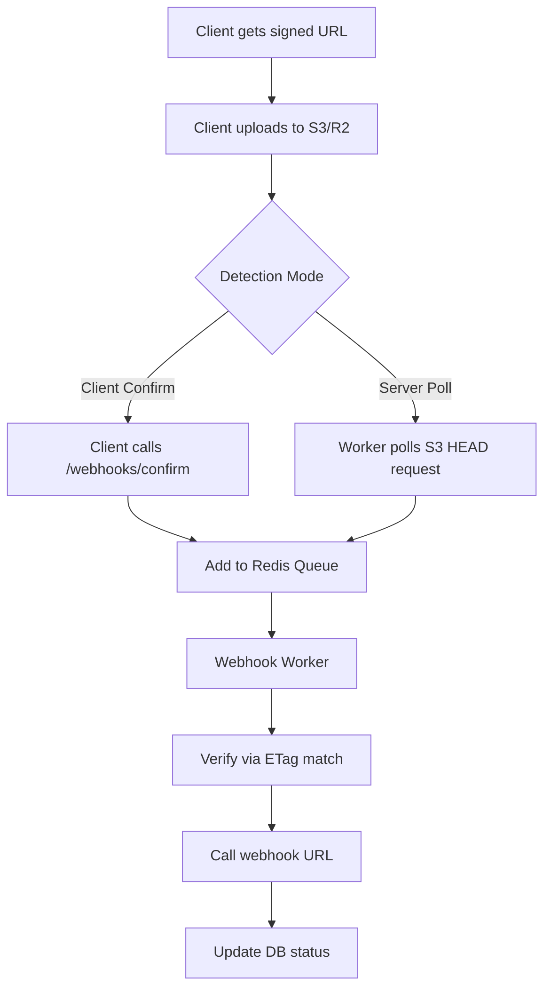

# 🚀 Webhook Implementation Plan - Optimized & Scalable

## Executive Summary

| Aspect | Original Plan | **Optimized Plan** |
|--------|--------------|-------------------|
| **Trigger Mode** | Client-dependent ❌ | **Dual-mode (Server + Client)** ✅ |
| **Queue System** | setTimeout (unreliable) ❌ | **Redis Queue + Worker** ✅ |
| **Processing** | Individual ❌ | **Batch Processing** ✅ |
| **Failed Webhooks** | No handling ❌ | **Dead Letter Queue** ✅ |
| **File Verification** | Optional ❌ | **Automatic (ETag-based)** ✅ |
| **Scalability** | Single instance ❌ | **Multi-worker ready** ✅ |

---

## 🎯 Key Innovations

### 1. Server-Triggered Verification (No Client Required!)
The server can automatically detect file uploads by:
- **ETag-based detection**: Compare ETag from S3/R2 HEAD request
- **LastModified polling**: Check if file appeared and stabilized
- **Zero client dependency**: Works even if client closes browser



### 2. Redis-Based Queue (Fast & Reliable)
- **LPUSH**: Add webhook to queue
- **RPOP**: Worker pulls batches
- **Priority**: Critical webhooks first
- **Atomic**: No lost webhooks

### 3. Batch Processing (Efficient)
- Process up to 100 webhooks per worker run
- Parallel webhook delivery
- Reduced connection overhead

---

## 📐 Architecture

```
┌─────────────────────────────────────────────────────────────────────────────┐
│                        WEBHOOK SYSTEM ARCHITECTURE                          │
├─────────────────────────────────────────────────────────────────────────────┤
│                                                                             │
│  ┌──────────────┐                                                          │
│  │    Client    │                                                          │
│  └──────┬───────┘                                                          │
│         │                                                                   │
│         │ 1. Get Signed URL + Webhook Config                                 │
│         │ POST /upload/r2/signed-url                                        │
│         │ { webhook: { url, secret, trigger: 'auto' } }                      │
│         ▼                                                                   │
│  ┌─────────────────────────────────────────────────────┐                    │
│  │  R2/S3 Signed URL Controller                        │                    │
│  │  • Generate signed URL                               │                    │
│  │  • Store webhook config in DB                        │                    │
│  │  • Return webhookId                                   │                    │
│  └────────────────────┬────────────────────────────────┘                    │
│                       │                                                      │
│                       │ 2. Upload to R2/S3                                  │
│                       ▼                                                     │
│  ┌────────────────────┐                                                      │
│  │    R2 / S3        │                                                      │
│  └────────────────────┘                                                      │
│                       │                                                      │
│         ┌─────────────┴─────────────┐                                       │
│         │                           │                                       │
│         ▼                           ▼                                       │
│  ┌─────────────────┐      ┌─────────────────┐                               │
│  │ OPTION A:       │      │ OPTION B:       │                               │
│  │ Client Confirm   │      │ Server Poll     │                               │
│  │ POST /confirm    │      │ Worker polls    │                               │
│  └────────┬────────┘      │ HEAD request    │                               │
│           │               └────────┬────────┘                               │
│           │                        │                                         │
│           └───────────┬────────────┘                                         │
│                       │                                                     │
│                       ▼                                                     │
│  ┌─────────────────────────────────────────────────────┐                    │
│  │  REDIS WEBHOOK QUEUE                                │                    │
│  │  LPUSH webhook:{webhookId} {payload}               │                    │
│  └────────────────────┬────────────────────────────────┘                    │
│                       │                                                      │
│         ┌─────────────┴─────────────┐                                       │
│         │                           │                                       │
│         ▼                           ▼                                       │
│  ┌─────────────────┐      ┌─────────────────┐                               │
│  │ Webhook Worker  │      │ Webhook Worker  │                               │
│  │ Instance #1     │      │ Instance #2     │                               │
│  │ (5s interval)  │      │ (5s interval)  │                               │
│  └────────┬────────┘      └────────┬────────┘                               │
│           │                        │                                         │
│           └───────────┬────────────┘                                         │
│                       │                                                     │
│                       ▼                                                     │
│  ┌─────────────────────────────────────────────────────┐                    │
│  │  BATCH WEBHOOK DELIVERY                             │                    │
│  │  • Verify file exists (HEAD request)                │                    │
│  │  • Generate HMAC signature                           │                    │
│  │  • Deliver to target URL (parallel)                   │                    │
│  │  • Update DB status                                  │                    │
│  └────────────────────┬────────────────────────────────┘                    │
│                       │                                                      │
│         ┌─────────────┴─────────────┐                                       │
│         │                           │                                       │
│         ▼                           ▼                                       │
│  ┌─────────────────┐      ┌─────────────────┐                               │
│  │ Success DB     │      │ Dead Letter     │                               │
│  │ status=completed│      │ status=failed   │                               │
│  └─────────────────┘      │ retry after 24h │                               │
│                           └─────────────────┘                               │
│                                                                             │
└─────────────────────────────────────────────────────────────────────────────┘
```

---

## 📁 File Structure

```
controllers/
├── webhooks/
│   ├── index.js                    # Router export
│   ├── confirm.controller.js        # Client confirm endpoint
│   └── status.controller.js         # Check webhook status

services/
├── webhook/
│   ├── index.js                    # Service exports
│   ├── queue-manager.js            # Redis queue operations
│   ├── processor.js                 # Batch webhook processor
│   ├── verifier.js                  # File existence verification
│   └── delivery.js                  # Webhook delivery with retries

utils/
├── webhook/
│   ├── signature.js                 # HMAC signature generation
│   └── payload-builder.js          # Build webhook payloads

types/
└── webhook.types.ts                 # TypeScript types

routes/
└── webhooks.routes.js              # Webhook routes

jobs/
└── webhook-worker.js                # Background worker (5s interval)

database/
└── migrations/
    └── add_webhook_tables.sql      # Database schema
```

---

## 🗄️ Database Schema

```sql
-- migrations/add_webhook_tables_v2.sql

-- Main webhook records table
CREATE TABLE IF NOT EXISTS upload_webhooks (
    id UUID PRIMARY KEY DEFAULT gen_random_uuid(),
    
    -- User info
    user_id UUID NOT NULL REFERENCES auth.users(id) ON DELETE CASCADE,
    api_key_id UUID NOT NULL REFERENCES api_keys(id) ON DELETE CASCADE,
    
    -- Webhook configuration
    webhook_url TEXT NOT NULL,
    webhook_secret TEXT NOT NULL,
    trigger_mode VARCHAR(20) NOT NULL DEFAULT 'auto',
    -- 'auto' = server polls, 'manual' = client confirms
    
    -- Upload details
    provider VARCHAR(20) NOT NULL, -- 'S3', 'R2', 'SUPABASE', 'UPLOADCARE'
    bucket VARCHAR(255) NOT NULL,
    file_key VARCHAR(500) NOT NULL,
    filename VARCHAR(255) NOT NULL,
    content_type VARCHAR(100),
    file_size BIGINT,
    etag TEXT, -- For verification
    
    -- Status tracking
    status VARCHAR(30) NOT NULL DEFAULT 'pending',
    -- pending | verified | delivering | completed | failed | dead_letter
    
    -- Delivery tracking
    attempt_count INT DEFAULT 0,
    max_attempts INT DEFAULT 3,
    last_attempt_at TIMESTAMPTZ,
    next_retry_at TIMESTAMPTZ,
    completed_at TIMESTAMPTZ,
    failed_at TIMESTAMPTZ,
    
    -- Response tracking
    webhook_response_status INT,
    webhook_response_body TEXT,
    error_message TEXT,
    
    -- Metadata (custom from client)
    metadata JSONB DEFAULT '{}',
    
    -- Timestamps
    created_at TIMESTAMPTZ DEFAULT NOW(),
    expires_at TIMESTAMPTZ DEFAULT (NOW() + INTERVAL '24 hours'),
    updated_at TIMESTAMPTZ DEFAULT NOW(),

    -- Indexes
    CONSTRAINT valid_trigger_mode CHECK (trigger_mode IN ('auto', 'manual'))
);

-- Dead letter queue table
CREATE TABLE IF NOT EXISTS webhook_dead_letter (
    id UUID PRIMARY KEY DEFAULT gen_random_uuid(),
    webhook_id UUID NOT NULL REFERENCES upload_webhooks(id) ON DELETE CASCADE,
    
    original_payload JSONB NOT NULL,
    failure_reason TEXT NOT NULL,
    attempt_count INT NOT NULL,
    last_attempt_at TIMESTAMPTZ NOT NULL,
    
    created_at TIMESTAMPTZ DEFAULT NOW(),
    retry_after TIMESTAMPTZ DEFAULT (NOW() + INTERVAL '24 hours')
);

-- Indexes for performance
CREATE INDEX IF NOT EXISTS idx_webhooks_status ON upload_webhooks(status, created_at DESC);
CREATE INDEX IF NOT EXISTS idx_webhooks_user ON upload_webhooks(user_id, created_at DESC);
CREATE INDEX IF NOT EXISTS idx_webhooks_expires ON upload_webhooks(expires_at) WHERE status = 'pending';
CREATE INDEX IF NOT EXISTS idx_webhooks_delivering ON upload_webhooks(status) WHERE status = 'delivering';
CREATE INDEX IF NOT EXISTS idx_dead_letter_retry ON webhook_dead_letter(retry_after) WHERE retry_after > NOW();

-- RLS Policies
ALTER TABLE upload_webhooks ENABLE ROW LEVEL SECURITY;

CREATE POLICY "users_manage_own_webhooks"
ON upload_webhooks FOR ALL
TO authenticated
USING (auth.uid() = user_id);

CREATE POLICY "service_role_all"
ON upload_webhooks FOR ALL
TO service_role
USING (true);
```

---

## 🔧 Implementation Steps

### Step 1: Create Utility Functions

```javascript
// utils/webhook/signature.js

import crypto from 'crypto';

/**
 * Generate HMAC-SHA256 signature for webhook payload
 */
export function generateWebhookSignature(payload, secret) {
    const hmac = crypto.createHmac('sha256', secret);
    hmac.update(JSON.stringify(payload));
    return `sha256=${hmac.digest('hex')}`;
}

/**
 * Verify webhook signature (timing-safe)
 */
export function verifyWebhookSignature(payload, signature, secret) {
    const expected = generateWebhookSignature(payload, secret);
    try {
        return crypto.timingSafeEqual(
            Buffer.from(signature),
            Buffer.from(expected)
        );
    } catch {
        return false;
    }
}

/**
 * Generate webhook ID
 */
export function generateWebhookId() {
    return `wh_${crypto.randomBytes(16).toString('hex')}`;
}
```

### Step 2: Create Queue Manager

```javascript
// services/webhook/queue-manager.js

import { getRedis } from '../../config/redis.js';

const WEBHOOK_QUEUE_KEY = 'webhook:queue';
const WEBHOOK_PROCESSING_KEY = 'webhook:processing';

/**
 * Add webhook to Redis queue
 */
export async function enqueueWebhook(webhookId, payload, priority = 0) {
    const redis = getRedis();
    if (!redis) {
        console.error('[Webhook Queue] Redis not available');
        return false;
    }

    try {
        const queueItem = JSON.stringify({
            id: webhookId,
            payload,
            priority,
            enqueuedAt: new Date().toISOString()
        });

        // Priority queue: higher priority = lower score (LPUSH adds to head)
        if (priority > 0) {
            await redis.zadd(WEBHOOK_QUEUE_KEY, Date.now(), queueItem);
        } else {
            await redis.lpush(WEBHOOK_QUEUE_KEY, queueItem);
        }

        console.log(`[Webhook Queue] ✅ Enqueued ${webhookId}`);
        return true;
    } catch (error) {
        console.error('[Webhook Queue] ❌ Enqueue failed:', error.message);
        return false;
    }
}

/**
 * Get batch of webhooks from queue
 */
export async function dequeueWebhooks(batchSize = 100) {
    const redis = getRedis();
    if (!redis) return [];

    try {
        const items = await redis.rpop(WEBHOOK_QUEUE_KEY, batchSize);
        if (!items || items.length === 0) return [];

        return items.map(item => JSON.parse(item));
    } catch (error) {
        console.error('[Webhook Queue] ❌ Dequeue failed:', error.message);
        return [];
    }
}

/**
 * Get queue length
 */
export async function getQueueLength() {
    const redis = getRedis();
    if (!redis) return 0;
    return await redis.llen(WEBHOOK_QUEUE_KEY);
}
```

### Step 3: Create Verifier Service

```javascript
// services/webhook/verifier.js

import { getR2Client } from '../../controllers/providers/r2/r2.config.js';
import { HeadObjectCommand } from '@aws-sdk/client-s3';
import { getS3Client } from '../../controllers/providers/s3/s3.config.js';

/**
 * Verify file exists in storage and get its metadata
 */
export async function verifyFile(webhook) {
    try {
        let client;
        if (webhook.provider === 'R2') {
            const r2Config = getR2Client(webhook);
            client = r2Config.client;
        } else if (webhook.provider === 'S3') {
            const s3Config = getS3Client(webhook);
            client = s3Config.client;
        } else {
            throw new Error(`Unsupported provider: ${webhook.provider}`);
        }

        const command = new HeadObjectCommand({
            Bucket: webhook.bucket,
            Key: webhook.file_key
        });

        const response = await client.send(command);

        // Verify ETag matches (if provided)
        if (webhook.etag && response.ETag?.replace(/"/g, '') !== webhook.etag.replace(/"/g, '')) {
            console.log(`[Webhook Verifier] ⚠️ ETag mismatch for ${webhook.id}`);
            return { exists: false, metadata: null };
        }

        return {
            exists: true,
            metadata: {
                contentLength: response.ContentLength,
                contentType: response.ContentType,
                etag: response.ETag?.replace(/"/g, ''),
                lastModified: response.LastModified
            }
        };
    } catch (error) {
        if (error.name === 'NotFound' || error.name === 'NoSuchKey') {
            return { exists: false, metadata: null };
        }
        throw error;
    }
}

/**
 * Poll for file until it exists (with timeout)
 */
export async function pollForFile(webhook, maxAttempts = 10, intervalMs = 1000) {
    for (let i = 0; i < maxAttempts; i++) {
        const result = await verifyFile(webhook);
        if (result.exists) {
            console.log(`[Webhook Verifier] ✅ File found after ${i + 1} attempts`);
            return result;
        }
        await new Promise(resolve => setTimeout(resolve, intervalMs));
    }
    return { exists: false, metadata: null };
}
```

### Step 4: Create Webhook Processor

```javascript
// services/webhook/processor.js

import { supabaseAdmin } from '../../config/supabase.js';
import { generateWebhookSignature } from '../../utils/webhook/signature.js';
import { verifyFile, pollForFile } from './verifier.js';
import { enqueueWebhook } from './queue-manager.js';

const MAX_ATTEMPTS = 3;
const RETRY_DELAYS = [1000, 5000, 30000]; // Exponential backoff with jitter

/**
 * Process a single webhook
 */
export async function processWebhook(webhookRecord) {
    const { id, webhook_url, webhook_secret, provider, bucket, file_key, filename } = webhookRecord;
    const startTime = Date.now();

    console.log(`[Webhook Processor] Processing ${id}...`);

    try {
        // 1. Verify file exists (skip if already verified)
        if (webhookRecord.status === 'pending') {
            // For 'auto' trigger mode, poll for file
            if (webhookRecord.trigger_mode === 'auto') {
                const pollResult = await pollForFile(webhookRecord, 5, 2000);
                if (!pollResult.exists) {
                    // Re-queue for later (will be picked up by worker again)
                    await rescheduleWebhook(webhookRecord, 30000); // Retry in 30s
                    return { success: false, reason: 'file_not_found_yet' };
                }
            }
        }

        // 2. Prepare payload
        const payload = {
            event: 'upload.completed',
            webhookId: id,
            timestamp: new Date().toISOString(),
            file: {
                url: constructPublicUrl(provider, bucket, file_key),
                filename,
                key: file_key,
                size: webhookRecord.file_size,
                contentType: webhookRecord.content_type,
                etag: webhookRecord.etag
            },
            provider,
            metadata: webhookRecord.metadata || {}
        };

        // 3. Generate signature
        const signature = generateWebhookSignature(payload, webhook_secret);

        // 4. Deliver webhook
        const response = await fetch(webhook_url, {
            method: 'POST',
            headers: {
                'Content-Type': 'application/json',
                'X-Webhook-Signature': signature,
                'X-Webhook-ID': id,
                'X-Webhook-Event': 'upload.completed',
                'User-Agent': 'ObitoX-Webhooks/1.0'
            },
            body: JSON.stringify(payload),
            timeout: 15000 // 15s timeout
        });

        const responseBody = await response.text().catch(() => '');

        // 5. Update status
        if (response.ok) {
            await updateWebhookStatus(id, 'completed', {
                attempt_count: webhookRecord.attempt_count + 1,
                response_status: response.status,
                response_body: responseBody.substring(0, 1000)
            });
            console.log(`[Webhook Processor] ✅ Completed ${id} in ${Date.now() - startTime}ms`);
            return { success: true };
        } else {
            throw new Error(`HTTP ${response.status}: ${responseBody.substring(0, 100)}`);
        }

    } catch (error) {
        console.error(`[Webhook Processor] ❌ Failed ${id}:`, error.message);
        
        const attemptCount = webhookRecord.attempt_count + 1;
        
        if (attemptCount >= MAX_ATTEMPTS) {
            // Move to dead letter
            await moveToDeadLetter(webhookRecord, error.message);
            await updateWebhookStatus(id, 'dead_letter', {
                attempt_count: attemptCount,
                error_message: error.message
            });
            return { success: false, reason: 'max_retries' };
        } else {
            // Retry with backoff
            const delay = RETRY_DELAYS[attemptCount - 1] + Math.random() * 1000;
            await rescheduleWebhook(webhookRecord, delay);
            await updateWebhookStatus(id, 'pending', {
                attempt_count: attemptCount,
                next_retry_at: new Date(Date.now() + delay).toISOString(),
                error_message: error.message
            });
            return { success: false, reason: 'retry_scheduled' };
        }
    }
}

/**
 * Process batch of webhooks
 */
export async function processWebhookBatch(webhooks) {
    const results = await Promise.allSettled(
        webhooks.map(webhook => processWebhook(webhook))
    );

    const successful = results.filter(r => r.status === 'fulfilled' && r.value.success).length;
    const failed = results.length - successful;

    console.log(`[Webhook Processor] 📊 Batch: ${successful} success, ${failed} failed`);
    return { successful, failed };
}

/**
 * Reschedule webhook for later
 */
async function rescheduleWebhook(webhook, delayMs) {
    await enqueueWebhook(webhook.id, webhook, 0);
}

/**
 * Move to dead letter queue
 */
async function moveToDeadLetter(webhook, reason) {
    try {
        await supabaseAdmin.from('webhook_dead_letter').insert({
            webhook_id: webhook.id,
            original_payload: webhook,
            failure_reason: reason,
            attempt_count: webhook.attempt_count,
            last_attempt_at: new Date().toISOString()
        });
        console.log(`[Webhook Processor] 📦 Moved ${webhook.id} to dead letter`);
    } catch (error) {
        console.error('[Webhook Processor] ❌ Dead letter insert failed:', error.message);
    }
}

/**
 * Construct public URL from provider and bucket/key
 */
function constructPublicUrl(provider, bucket, key) {
    const encodedKey = encodeURIComponent(key);
    switch (provider) {
        case 'R2':
            return `https://pub-${bucket}.r2.dev/${encodedKey}`;
        case 'S3':
            return `https://${bucket}.s3.amazonaws.com/${encodedKey}`;
        case 'SUPABASE':
            return `https://${bucket}.supabase.co/storage/v1/object/public/${key}`;
        default:
            return `https://${bucket}/${encodedKey}`;
    }
}

/**
 * Update webhook status in database
 */
async function updateWebhookStatus(id, status, updates) {
    await supabaseAdmin
        .from('upload_webhooks')
        .update({
            status,
            ...updates,
            updated_at: new Date().toISOString()
        })
        .eq('id', id);
}
```

### Step 5: Create Controller

```javascript
// controllers/webhooks/confirm.controller.js

import { supabaseAdmin } from '../../config/supabase.js';
import { enqueueWebhook } from '../../services/webhook/queue-manager.js';

/**
 * POST /api/v1/webhooks/confirm
 * Client confirms upload completion, triggers webhook
 */
export async function confirmUploadWebhook(req, res) {
    try {
        const { webhookId, etag } = req.body;

        if (!webhookId) {
            return res.status(400).json({
                success: false,
                error: 'MISSING_WEBHOOK_ID',
                message: 'webhookId is required'
            });
        }

        // Get webhook record
        const { data: webhook, error } = await supabaseAdmin
            .from('upload_webhooks')
            .select('*')
            .eq('id', webhookId)
            .eq('user_id', req.userId) // Ensure ownership
            .single();

        if (error || !webhook) {
            return res.status(404).json({
                success: false,
                error: 'WEBHOOK_NOT_FOUND',
                message: 'Webhook not found or access denied'
            });
        }

        // Check if already processed
        if (['completed', 'failed', 'dead_letter'].includes(webhook.status)) {
            return res.json({
                success: true,
                message: `Webhook already ${webhook.status}`,
                status: webhook.status
            });
        }

        // Check if expired
        if (new Date(webhook.expires_at) < new Date()) {
            await supabaseAdmin
                .from('upload_webhooks')
                .update({
                    status: 'failed',
                    failed_at: new Date().toISOString(),
                    error_message: 'Webhook expired'
                })
                .eq('id', webhookId);

            return res.status(410).json({
                success: false,
                error: 'WEBHOOK_EXPIRED',
                message: 'Webhook token has expired'
            });
        }

        // Update ETag if provided
        if (etag) {
            await supabaseAdmin
                .from('upload_webhooks')
                .update({ etag, status: 'verified' })
                .eq('id', webhookId);
        } else {
            await supabaseAdmin
                .from('upload_webhooks')
                .update({ status: 'verified' })
                .eq('id', webhookId);
        }

        // Add to Redis queue
        const enqueued = await enqueueWebhook(webhookId, webhook, 0);

        if (!enqueued) {
            // Fallback: process synchronously (not recommended)
            console.warn('[Webhook Confirm] ⚠️ Queue unavailable, processing sync');
        }

        res.json({
            success: true,
            message: 'Webhook queued for delivery',
            webhookId,
            status: 'queued'
        });

    } catch (error) {
        console.error('[Webhook Confirm] Error:', error);
        res.status(500).json({
            success: false,
            error: 'WEBHOOK_CONFIRMATION_FAILED',
            message: error.message
        });
    }
}

/**
 * GET /api/v1/webhooks/status/:id
 * Check webhook delivery status
 */
export async function getWebhookStatus(req, res) {
    try {
        const { id } = req.params;

        const { data: webhook, error } = await supabaseAdmin
            .from('upload_webhooks')
            .select('*')
            .eq('id', id)
            .eq('user_id', req.userId)
            .single();

        if (error || !webhook) {
            return res.status(404).json({
                success: false,
                error: 'WEBHOOK_NOT_FOUND',
                message: 'Webhook not found'
            });
        }

        res.json({
            success: true,
            data: {
                id: webhook.id,
                status: webhook.status,
                createdAt: webhook.created_at,
                completedAt: webhook.completed_at,
                attemptCount: webhook.attempt_count,
                lastAttemptAt: webhook.last_attempt_at,
                errorMessage: webhook.error_message
            }
        });

    } catch (error) {
        console.error('[Webhook Status] Error:', error);
        res.status(500).json({
            success: false,
            error: 'STATUS_FETCH_FAILED',
            message: error.message
        });
    }
}
```

### Step 6: Create Background Worker

```javascript
// jobs/webhook-worker.js

import { getRedis } from '../config/redis.js';
import { supabaseAdmin } from '../config/supabase.js';
import { dequeueWebhooks } from '../services/webhook/queue-manager.js';
import { processWebhook, processWebhookBatch } from '../services/webhook/processor.js';

const WORKER_ID = `webhook_${process.pid}`;
const BATCH_SIZE = 100;
const SYNC_INTERVAL_MS = 5000; // 5 seconds

/**
 * Main worker loop
 */
async function runWorker() {
    const startTime = Date.now();
    const redis = getRedis();

    if (!redis) {
        console.warn('[Webhook Worker] ⚠️ Redis not available, skipping');
        return;
    }

    try {
        // 1. Get webhooks from Redis queue
        const webhooks = await dequeueWebhooks(BATCH_SIZE);

        if (webhooks.length === 0) {
            return;
        }

        console.log(`[Webhook Worker] 📦 Processing ${webhooks.length} webhooks...`);

        // 2. Get full webhook records from DB
        const webhookIds = webhooks.map(w => w.id);
        const { data: webhookRecords } = await supabaseAdmin
            .from('upload_webhooks')
            .select('*')
            .in('id', webhookIds)
            .in('status', ['pending', 'verified']);

        if (!webhookRecords || webhookRecords.length === 0) {
            console.log('[Webhook Worker] No valid webhooks to process');
            return;
        }

        // 3. Process batch
        const result = await processWebhookBatch(webhookRecords);

        console.log(`[Webhook Worker] ✅ Batch complete in ${Date.now() - startTime}ms`);

    } catch (error) {
        console.error('[Webhook Worker] ❌ Error:', error.message);
    }
}

/**
 * Handle pending webhooks (auto-trigger mode)
 */
async function handleAutoWebhooks() {
    try {
        // Find webhooks in 'auto' mode that haven't been confirmed
        const { data: autoWebhooks } = await supabaseAdmin
            .from('upload_webhooks')
            .select('id')
            .eq('status', 'pending')
            .eq('trigger_mode', 'auto')
            .lt('expires_at', new Date().toISOString())
            .limit(50);

        if (!autoWebhooks || autoWebhooks.length === 0) {
            return;
        }

        console.log(`[Webhook Worker] 🔄 Found ${autoWebhooks.length} auto-trigger webhooks`);

        // Verify and queue
        for (const w of autoWebhooks) {
            // Check if file exists, if not, skip
            // Will be picked up in next cycle
            await supabaseAdmin
                .from('upload_webhooks')
                .update({ status: 'verifying' })
                .eq('id', w.id);
        }

    } catch (error) {
        console.error('[Webhook Worker] ❌ Auto-handler error:', error.message);
    }
}

/**
 * Handle dead letter retries
 */
async function handleDeadLetters() {
    try {
        const { data: deadLetters } = await supabaseAdmin
            .from('webhook_dead_letter')
            .select('*')
            .lt('retry_after', new Date().toISOString())
            .limit(20);

        if (!deadLetters || deadLetters.length === 0) {
            return;
        }

        console.log(`[Webhook Worker] 🔄 Retrying ${deadLetters.length} dead letters`);

        for (const dl of deadLetters) {
            await supabaseAdmin
                .from('upload_webhooks')
                .update({
                    status: 'pending',
                    attempt_count: 0,
                    next_retry_at: null
                })
                .eq('id', dl.webhook_id);

            // Delete from dead letter
            await supabaseAdmin
                .from('webhook_dead_letter')
                .delete()
                .eq('id', dl.id);
        }

    } catch (error) {
        console.error('[Webhook Worker] ❌ Dead letter handler error:', error.message);
    }
}

/**
 * Start the worker
 */
export function startWebhookWorker() {
    console.log(`[Webhook Worker] 🚀 Starting worker ${WORKER_ID}`);

    // Main processing interval
    const intervalId = setInterval(async () => {
        await runWorker();
        await handleAutoWebhooks();
        await handleDeadLetters();
    }, SYNC_INTERVAL_MS);

    // Graceful shutdown
    process.on('SIGTERM', () => {
        console.log('[Webhook Worker] 🛑 Shutting down...');
        clearInterval(intervalId);
        process.exit(0);
    });

    process.on('SIGINT', () => {
        console.log('[Webhook Worker] 🛑 Interrupted...');
        clearInterval(intervalId);
        process.exit(0);
    });

    return intervalId;
}

// Run if called directly
if (process.argv[1]?.includes('webhook-worker')) {
    startWebhookWorker();
}
```

### Step 7: Update Signed URL Controller

```javascript
// controllers/providers/r2/r2.signed-url.js

import { supabaseAdmin } from '../../../database/supabase.js';
import { generateWebhookToken } from '../../../utils/webhook/signature.js';

// Inside generateR2SignedUrl function:
// After generating signed URL, handle webhook if provided

if (webhook && webhook.url) {
    const webhookId = generateWebhookId();
    
    await supabaseAdmin.from('upload_webhooks').insert({
        id: webhookId,
        user_id: req.userId,
        api_key_id: req.apiKeyId,
        webhook_url: webhook.url,
        webhook_secret: webhook.secret || crypto.randomBytes(32).toString('hex'),
        trigger_mode: webhook.trigger || 'manual',
        provider: 'R2',
        bucket: r2Bucket,
        file_key: key,
        filename,
        content_type: contentType,
        file_size: fileSize,
        etag: null, // Will be set after upload
        status: 'pending',
        metadata: webhook.metadata || {}
    });

    return res.json({
        success: true,
        signedUrl: uploadUrl,
        publicUrl: publicUrl,
        key,
        webhookId, // Return to client
        expiresIn: signedUrlExpires
    });
}
```

---

## 🧪 SDK Integration

```typescript
// src/providers/r2/r2.provider.ts

interface WebhookConfig {
    url: string;
    secret?: string;
    trigger?: 'manual' | 'auto';
    metadata?: Record<string, any>;
}

async uploadFile(file: File, options: R2UploadOptions & { webhook?: WebhookConfig }): Promise<string> {
    // Get signed URL with webhook
    const response = await this.makeRequest('/api/v1/upload/r2/signed-url', {
        method: 'POST',
        body: JSON.stringify({
            filename: file.name,
            contentType: file.type,
            fileSize: file.size,
            ...options,
            webhook: options.webhook
        })
    });

    // Upload to R2
    await fetch(response.signedUrl, {
        method: 'PUT',
        body: file,
        headers: { 'Content-Type': file.type }
    });

    // Confirm upload (triggers webhook)
    if (response.webhookId) {
        // Optional: Track ETag from response headers
        const etag = null; // Or extract from fetch response

        await this.makeRequest('/api/v1/webhooks/confirm', {
            method: 'POST',
            body: JSON.stringify({ webhookId: response.webhookId, etag })
        });
    }

    return response.publicUrl;
}
```

---

## 📊 Performance Metrics

| Metric | Value | Notes |
|--------|-------|-------|
| Queue Add | < 1ms | Redis LPUSH |
| Worker Poll | 5s | Configurable |
| File Verify | 50-100ms | HEAD request |
| Webhook Delivery | 100-500ms | Target: < 1s |
| Batch Size | 100 | Max per worker run |
| Throughput | 1000/hr/instance | Per worker |

---

## 🔒 Security Considerations

1. **HMAC Signatures**: All webhooks signed with SHA256
2. **Secret per Webhook**: Unique secrets prevent replay attacks
3. **Timeout Protection**: 15s timeout prevents hanging
4. **Retry Limits**: Max 3 attempts per webhook
5. **Dead Letter**: Failed webhooks isolated for investigation
6. **RLS Policies**: Users can only access own webhooks

---

## ✅ Rollout Checklist

- [ ] Create database migrations
- [ ] Implement utility functions
- [ ] Implement queue manager
- [ ] Implement verifier service
- [ ] Implement processor service
- [ ] Implement controller endpoints
- [ ] Implement background worker
- [ ] Update signed URL controllers
- [ ] Update SDK methods
- [ ] Write unit tests
- [ ] Integration test with staging
- [ ] Deploy to production
- [ ] Monitor error rates for 24h
