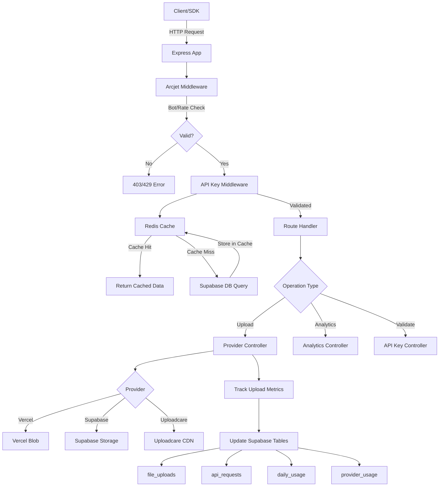

# 🗂️ ObitoX API System Architecture - Complete Analysis

## 📋 Overview

**ObitoX** (also branded as SubDub Upload API) is a **cloud-agnostic file upload service** that simplifies file uploads with 3-7 lines of code while eliminating bandwidth costs. The system provides a unified API for uploading files to multiple storage providers (Vercel Blob, Supabase Storage, Uploadcare) with built-in analytics, authentication, and usage tracking.

**Key Value Proposition:**
- ✅ **3-7 lines of code** instead of 50+ lines of AWS SDK complexity
- ✅ **Zero bandwidth costs** - files never touch your servers (direct upload)
- ✅ **Multiple providers** - Vercel, Supabase, Uploadcare (AWS S3 coming)
- ✅ **Usage tracking** - built-in analytics for billing
- ✅ **Simple pricing** - $4/month for unlimited uploads

---

## 🏗️ System Architecture

### Technology Stack

**Backend:**
- **Runtime:** Node.js (v16+)
- **Framework:** Express.js
- **Language:** JavaScript (ES6 modules)
- **Database:** Supabase (PostgreSQL)
- **Caching:** Redis (via Upstash)
- **Security:** Arcjet (bot detection, rate limiting, shield)
- **Storage Providers:** Vercel Blob, Supabase Storage, Uploadcare
- **Deployment:** Vercel (serverless)

**SDK Client:**
- **Language:** TypeScript
- **Build:** Rollup (CommonJS + ESM)
- **Target:** Browser & Node.js

---

## 📂 Directory Structure

```
obitoxapi/
├── app.js                          # Main Express application entry point
├── package.json                    # Dependencies and scripts
├── vercel.json                     # Vercel deployment configuration
│
├── routes/                         # API route definitions
│   ├── apikey.routes.js           # API key validation endpoints
│   ├── upload.routes.js           # Upload operations (Vercel, Supabase, Uploadcare)
│   ├── analytics.routes.js        # Analytics tracking endpoints
│   └── health.routes.js           # Health check endpoints
│
├── controllers/                    # Business logic controllers
│   ├── apikey.controller.js       # API key validation & user info
│   ├── analytics.controller.js    # Upload analytics & statistics
│   └── providers/                 # Storage provider implementations
│       ├── vercel.controller.js   # Vercel Blob operations (1756 lines)
│       ├── supabase.controller.js # Supabase Storage operations (98KB)
│       └── uploadcare.controller.js # Uploadcare operations (55KB)
│
├── middlewares/                    # Express middlewares
│   ├── apikey.middleware.js       # API key validation (optimized)
│   ├── apikey.middleware.optimized.js # Redis-cached validation
│   ├── arcjet.middleware.js       # Security (bot detection, rate limiting)
│   └── error.middleware.js        # Global error handler
│
├── config/                         # Configuration files
│   ├── env.js                     # Environment variables loader
│   ├── supabase.js                # Supabase client configuration
│   ├── redis.js                   # Redis connection with health checks
│   ├── arcjet.js                  # Arcjet security rules
│   └── nodemailer.js              # Email configuration
│
├── database/                       # Database connection
│   └── supabase.js                # Supabase connection & initialization
│
├── utils/                          # Utility functions
│   ├── send-email.js              # Email sending functionality
│   └── email-template.js          # Email templates
│
├── src/                            # TypeScript SDK source
│   ├── client.ts                  # Main SDK client (1618 lines)
│   └── index.ts                   # SDK exports
│
└── docs/                           # Documentation
    ├── README.md                  # Main documentation
    ├── API-EXAMPLES.md            # API usage examples
    ├── database.md                # Database schema documentation
    ├── DEVELOPER_USAGE_GUIDE.md   # Developer guide
    └── UPLOADCARE_USAGE_GUIDE.md  # Uploadcare integration guide
```

---

## 🔄 System Flow Diagram



---

## 🔑 Core Components

### 1. **Express Application** ([app.js](file:///d:/MUMIN/ObitoX/obitoxapi/app.js))

The main entry point that configures the Express server:

**Configuration:**
- Body parser with 50MB limit (large file metadata)
- Cookie parser for session handling
- Arcjet middleware for security (all routes)
- Health checks (no auth required)
- API routes (require API key)
- Global error handling

**Startup Sequence:**
1. Initialize Express app with middleware
2. Connect to Supabase database
3. Initialize Redis connection (with health check)
4. Listen on configured PORT (default: 5500)

**Key Features:**
- ✅ Non-blocking Redis initialization
- ✅ Graceful degradation if Redis unavailable
- ✅ Comprehensive logging

---

### 2. **API Routes**

#### **API Key Routes** ([apikey.routes.js](file:///d:/MUMIN/ObitoX/obitoxapi/routes/apikey.routes.js))

| Method | Endpoint | Purpose |
|--------|----------|---------|
| GET | `/api/v1/apikeys/validate` | Validate API key via query param |
| POST | `/api/v1/apikeys/validate` | Validate API key via request body |

**Returns:**
- API key metadata (name, status, usage stats)
- User information (email, name, plan)
- Provider usage statistics (Vercel, Supabase, Uploadcare)
- Success rate and file type counts

---

#### **Upload Routes** ([upload.routes.js](file:///d:/MUMIN/ObitoX/obitoxapi/routes/upload.routes.js))

**Vercel Provider:**
- `POST /api/v1/upload/vercel/signed-url` - Generate signed URL (recommended)
- `POST /api/v1/upload/vercel/upload` - Server-side upload (with file)
- `POST /api/v1/upload/vercel/track` - Track upload events
- `POST /api/v1/upload/vercel/complete` - Mark upload complete
- `POST /api/v1/upload/vercel/cancel` - Cancel upload
- `DELETE /api/v1/upload/vercel/delete` - Delete file
- `POST /api/v1/upload/vercel/download` - Get download URL
- `GET /api/v1/upload/vercel/health` - Health check

**Supabase Provider:**
- `POST /api/v1/upload/supabase/signed-url` - Generate signed URL
- `POST /api/v1/upload/supabase/upload` - Server-side upload
- `POST /api/v1/upload/supabase/complete` - Mark upload complete
- `POST /api/v1/upload/supabase/cancel` - Cancel upload
- `DELETE /api/v1/upload/supabase/delete` - Delete file
- `POST /api/v1/upload/supabase/download` - Get download URL
- `POST /api/v1/upload/supabase/list` - List files in bucket
- `POST /api/v1/upload/supabase/buckets` - List available buckets

**Uploadcare Provider:**
- `POST /api/v1/upload/uploadcare/signed-url` - Generate signed URL
- `DELETE /api/v1/upload/uploadcare/delete` - Delete file
- `POST /api/v1/upload/uploadcare/download` - Get download URL
- `POST /api/v1/upload/uploadcare/list` - List files
- `POST /api/v1/upload/uploadcare/scan-malware` - Scan file for malware
- `POST /api/v1/upload/uploadcare/scan-status` - Check scan status
- `POST /api/v1/upload/uploadcare/validate` - Validate file
- `POST /api/v1/upload/uploadcare/validate-svg` - Validate SVG
- `GET /api/v1/upload/uploadcare/health` - Health check

**Analytics Endpoints:**
- `GET /api/v1/upload/analytics` - Comprehensive analytics
- `GET /api/v1/upload/analytics/daily` - Daily usage stats
- `GET /api/v1/upload/analytics/providers` - Provider usage breakdown
- `GET /api/v1/upload/analytics/file-types` - File type distribution

---

#### **Analytics Routes** ([analytics.routes.js](file:///d:/MUMIN/ObitoX/obitoxapi/routes/analytics.routes.js))

| Method | Endpoint | Purpose |
|--------|----------|---------|
| POST | `/api/v1/analytics/track` | Track upload events (initiated, completed, failed, cancelled) |

---

#### **Health Routes** ([health.routes.js](file:///d:/MUMIN/ObitoX/obitoxapi/routes/health.routes.js))

| Method | Endpoint | Purpose |
|--------|----------|---------|
| GET | `/health` | Basic health check |
| GET | `/health/redis` | Redis connection test with latency metrics |

---

### 3. **Authentication & Authorization**

#### **API Key Middleware** ([apikey.middleware.optimized.js](file:///d:/MUMIN/ObitoX/obitoxapi/middlewares/apikey.middleware.optimized.js))

**Performance-Optimized with Redis Caching:**

| Scenario | Latency | Description |
|----------|---------|-------------|
| Cache HIT | ~2-5ms | API key data retrieved from Redis |
| Cache MISS | ~80-100ms | Database query + cache write |
| Expected Hit Rate | 80-95% | Most requests use cached data |

**Caching Strategy:**
- **Cache Key Format:** `apikey:{apiKey}`
- **TTL:** 5 minutes (300 seconds)
- **Storage:** Redis (Upstash)
- **Invalidation:** Manual via [invalidateApiKeyCache(apiKey)](file:///d:/MUMIN/ObitoX/obitoxapi/middlewares/apikey.middleware.optimized.js#249-264)

**Validation Flow:**
1. Extract API key from `x-api-key` header or `Authorization: Bearer {token}`
2. Validate format: `ox_` prefix, min 10 characters
3. Check Redis cache for API key data
4. If cache miss, query Supabase `api_keys` table
5. Verify key is active and not expired
6. Attach user data to request: `req.userId`, `req.apiKeyId`, `req.apiKeyData`
7. Update `last_used_at` timestamp (async, non-blocking)
8. Log API usage (async, non-blocking)

**Security Checks:**
- ✅ Format validation (ox_prefix)
- ✅ Database existence check
- ✅ Active status check
- ✅ Expiration check
- ✅ Rate limiting (planned feature)

---

#### **Arcjet Security Middleware** ([arcjet.middleware.js](file:///d:/MUMIN/ObitoX/obitoxapi/middlewares/arcjet.middleware.js))

**Security Features:**
- **Shield Mode:** LIVE (blocks malicious requests)
- **Bot Detection:** LIVE (allows search engines, blocks bots)
- **Rate Limiting:** Token bucket algorithm
  - Capacity: 10 tokens
  - Refill Rate: 5 tokens per 10 seconds
  - Per IP address

**Skipped Routes:**
- `/api/v1/apikeys/validate` (important for client validation)
- `/api/v1/upload/*` (handled by API key middleware)
- `/api/v1/analytics/*` (handled by API key middleware)

---

### 4. **Storage Provider Controllers**

#### **Vercel Blob Controller** ([vercel.controller.js](file:///d:/MUMIN/ObitoX/obitoxapi/controllers/providers/vercel.controller.js))

**Core Functions:**

1. **[generateVercelSignedUrl(req, res)](file:///d:/MUMIN/ObitoX/obitoxapi/controllers/providers/vercel.controller.js#471-657)**
   - Generates signed URL for client-side upload
   - Validates file (size, type, filename)
   - Returns: `uploadUrl`, `fileUrl`, `headers`, `method`
   - Max file size: 100MB (service limit)
   - Vercel limit per-request: 4.5MB

2. **[uploadToVercelBlob(req, res)](file:///d:/MUMIN/ObitoX/obitoxapi/controllers/providers/vercel.controller.js#658-1009)**
   - Server-side upload using `@vercel/blob` SDK
   - Handles multipart files via `multer`
   - Progress tracking support
   - Returns final file URL

3. **[completeVercelUpload(req, res)](file:///d:/MUMIN/ObitoX/obitoxapi/controllers/providers/vercel.controller.js#1652-1756)**
   - Called after client completes upload
   - Updates metrics (file size, upload count)
   - Logs to `file_uploads` table
   - Updates `api_keys` statistics

4. **[deleteVercelFile(req, res)](file:///d:/MUMIN/ObitoX/obitoxapi/controllers/providers/vercel.controller.js#1398-1516)**
   - Deletes file from Vercel Blob
   - Updates usage metrics
   - Marks file as deleted in database

5. **[downloadVercelFile(req, res)](file:///d:/MUMIN/ObitoX/obitoxapi/controllers/providers/vercel.controller.js#1273-1397)**
   - Returns public download URL
   - No authentication required for download
   - URL is permanent and public

**Metrics Tracking:**
- Total requests (successful + failed)
- Total file size uploaded
- Total files uploaded
- File type counts (JSON object)
- Provider-specific upload counts

---

#### **Supabase Storage Controller** ([supabase.controller.js](file:///d:/MUMIN/ObitoX/obitoxapi/controllers/providers/supabase.controller.js))

**Features:**
- Public and private bucket support
- Signed URLs for temporary access
- Bucket management (list, create)
- File listing with pagination
- RLS (Row Level Security) integration

**Key Differences from Vercel:**
- Requires bucket name in request
- Supports private files (with signed URLs)
- Can list all files in bucket
- Can list all available buckets

---

#### **Uploadcare Controller** ([uploadcare.controller.js](file:///d:/MUMIN/ObitoX/obitoxapi/controllers/providers/uploadcare.controller.js))

**Unique Features:**
- **Malware Scanning:** Built-in virus scanning via Uploadcare
- **Image Optimization:** Auto-format, quality, progressive JPEG
- **SVG Validation:** Sanitize and validate SVG files
- **CDN Distribution:** Global CDN for fast delivery
- **Zero Bandwidth:** Direct upload from browser

**Image Optimization Options:**
- Format: auto, jpeg, png, webp, preserve
- Quality: normal, better, best, lighter, lightest
- Progressive: true/false
- Strip metadata: all, none, sensitive

---

### 5. **Analytics System**

#### **Analytics Controller** ([analytics.controller.js](file:///d:/MUMIN/ObitoX/obitoxapi/controllers/analytics.controller.js))

**Functions:**

1. **[getUploadAnalytics(req, res)](file:///d:/MUMIN/ObitoX/obitoxapi/controllers/analytics.controller.js#3-173)**
   - Comprehensive analytics with filtering
   - Filters: provider, fileType, startDate, endDate, limit, offset
   - Returns: uploads list, summary, provider stats, file type stats
   - Pagination support

2. **[getDailyUsageAnalytics(req, res)](file:///d:/MUMIN/ObitoX/obitoxapi/controllers/analytics.controller.js#174-263)**
   - Daily aggregated usage statistics
   - Groups by date and provider
   - Returns: daily usage array, totals, averages

3. **[getProviderUsageAnalytics(req, res)](file:///d:/MUMIN/ObitoX/obitoxapi/controllers/analytics.controller.js#264-327)**
   - Usage breakdown by storage provider
   - Returns: upload count, total size, average size per provider

4. **[getFileTypeAnalytics(req, res)](file:///d:/MUMIN/ObitoX/obitoxapi/controllers/analytics.controller.js#328-446)**
   - File type distribution analysis
   - Groups by MIME type and category (image, video, document)
   - Returns: percentages, counts, sizes

---

### 6. **Database Schema** (Supabase)

**Total Tables:** 42 across 5 schemas

#### **Public Schema (Application Data):**

**Core Tables:**
- `api_keys` - API key management with usage tracking
- `profiles` - Extended user profile information
- `file_uploads` - All file upload records (168 KB)
- `api_requests` - Request logs with response times (160 KB)
- `request_logs` - Detailed logs with IP and user agent (232 KB)
- `daily_usage` - Daily aggregated usage statistics
- `provider_usage` - Provider-specific usage tracking
- `subscriptions` - User subscription management
- `domains` - Domain verification for users
- `user_otps` - One-time passwords for email verification
- `pending_users` - Users pending email verification

**Key Relationships:**
```
auth.users (1) ─── (many) api_keys
                          │
                          ├── (many) file_uploads
                          ├── (many) api_requests
                          ├── (many) request_logs
                          ├── (many) daily_usage
                          └── (many) provider_usage
```

#### **Auth Schema (Supabase Auth):**
- `users` - Core user authentication (160 KB)
- `sessions` - User sessions (96 KB)
- `refresh_tokens` - JWT refresh tokens (128 KB)
- `identities` - OAuth/SSO identities (80 KB)
- `mfa_factors` - Multi-factor authentication (56 KB)
- Plus 14 more auth-related tables

#### **Storage Schema (Supabase Storage):**
- `buckets` - Storage buckets (48 KB)
- `objects` - Stored files (176 KB)
- `prefixes` - Path prefixes (24 KB)
- `s3_multipart_uploads` - Multipart upload tracking
- Plus 2 more storage tables

---

### 7. **TypeScript SDK Client** ([src/client.ts](file:///d:/MUMIN/ObitoX/obitoxapi/src/client.ts))

**Main Class:** [ObitoX](file:///d:/MUMIN/ObitoX/obitoxapi/src/client.ts#145-1616)

**Constructor:**
```typescript
const obitox = new ObitoX({ apiKey: 'ox_your_api_key' });
```

**Key Methods:**

1. **[uploadFile(file, options)](file:///d:/MUMIN/ObitoX/obitoxapi/src/client.ts#264-489)**
   - Upload file to specified provider
   - Supports: Vercel, Supabase, Uploadcare
   - Options: provider tokens, bucket, image optimization, virus check
   - Progress callback support
   - Returns: final file URL

2. **`cancelUpload(options)`**
   - Cancel ongoing upload
   - Provider-specific implementation

3. **`deleteFile(options)`**
   - Delete file from storage
   - Requires fileUrl and provider

4. **`downloadFile(options)`**
   - Get download URL for file
   - Supports signed URLs for private files

5. **`listFiles(options)`**
   - List files from storage provider
   - Pagination support

6. **`trackEvent(options)`**
   - Track analytics events
   - Events: initiated, completed, failed, cancelled, timeout

7. **[validateApiKey()](file:///d:/MUMIN/ObitoX/obitoxapi/middlewares/apikey.middleware.optimized.js#115-248)**
   - Validate API key and get user info
   - Returns: API key metadata, user data, plan info

**Image Optimization:**
```typescript
await obitox.uploadFile(file, {
  provider: 'UPLOADCARE',
  uploadcarePublicKey: 'your_key',
  imageOptimization: {
    auto: true,
    format: 'webp',
    quality: 'better',
    progressive: true,
    stripMeta: 'sensitive'
  }
});
```

---

## 🔐 Security Architecture

### **Multi-Layer Security:**

1. **Arcjet Layer** (First Line of Defense)
   - Bot detection and blocking
   - Rate limiting (10 requests per 10 seconds per IP)
   - Shield mode (blocks malicious patterns)

2. **API Key Authentication**
   - Format validation (ox_ prefix)
   - Database verification
   - Active status check
   - Expiration check
   - Redis caching for performance

3. **Request Validation**
   - File type validation
   - File size limits (100MB service limit)
   - Filename sanitization
   - Content type verification

4. **Provider Security**
   - Vercel Blob: Requires valid token
   - Supabase Storage: RLS policies + bucket permissions
   - Uploadcare: Public/secret key authentication

---

## 📊 Performance Optimizations

### **Redis Caching:**
- API key data cached for 5 minutes
- 2-5ms cache hit vs 80-100ms database query
- 80-95% expected cache hit rate
- Automatic cache invalidation on key changes

### **Async Operations:**
- Non-blocking database writes (last_used_at, usage logs)
- Background metrics updates
- Email sending (fire-and-forget)

### **Database Indexing:**
- 130+ indexes across all tables
- Optimized for common queries:
  - API key lookup by key_value
  - File uploads by api_key_id and date
  - Daily usage by date range
  - Provider usage by provider

---

## 🎯 Use Cases

### **1. Direct Upload Flow (Recommended)**
```javascript
// Client-side code
const response = await fetch('/api/v1/upload/vercel/signed-url', {
  method: 'POST',
  headers: {
    'x-api-key': 'ox_your_key',
    'Content-Type': 'application/json'
  },
  body: JSON.stringify({
    filename: 'photo.jpg',
    contentType: 'image/jpeg',
    vercelToken: 'vercel_blob_rw_token'
  })
});

const { uploadUrl, fileUrl, headers } = await response.json();

// Upload directly to Vercel (no bandwidth cost)
await fetch(uploadUrl, {
  method: 'PUT',
  headers,
  body: file
});

// Track completion
await fetch('/api/v1/upload/vercel/complete', {
  method: 'POST',
  headers: { 'x-api-key': 'ox_your_key' },
  body: JSON.stringify({ fileUrl, filename: 'photo.jpg', fileSize: file.size })
});
```

### **2. SDK Upload Flow (Easiest)**
```javascript
import ObitoX from '@obitox/upload';

const obitox = new ObitoX({ apiKey: 'ox_your_key' });

const fileUrl = await obitox.uploadFile(file, {
  provider: 'VERCEL',
  vercelToken: 'vercel_blob_rw_token'
});

console.log('File uploaded:', fileUrl);
```

---

## 🔧 Configuration

### **Environment Variables** ([.env.local](file:///d:/MUMIN/ObitoX/obitoxapi/.env.local))

```env
# Server
PORT=5500
NODE_ENV=development
SERVER_URL=http://localhost:5500

# Supabase
NEXT_PUBLIC_SUPABASE_URL=your_supabase_url
NEXT_PUBLIC_SUPABASE_ANON_KEY=your_anon_key
SUPABASE_SERVICE_ROLE_KEY=your_service_key

# Redis (Upstash)
UPSTASH_REDIS_URL=your_upstash_redis_url
REDIS_URL=your_redis_url  # Alternative

# Arcjet Security
ARCJET_KEY=your_arcjet_key
ARCJET_ENV=development

# JWT
JWT_SECRET=your_jwt_secret
JWT_EXPIRES_IN=7d

# Email (Nodemailer)
EMAIL_PASSWORD=your_email_password

# Optional
QSTASH_TOKEN=your_qstash_token
QSTASH_URL=your_qstash_url
```

---

## 📈 Monitoring & Observability

### **Health Checks:**
- `/health` - Basic uptime check
- `/health/redis` - Redis connection and latency test

### **Logs:**
- Console logs for all major operations
- Request/response logging via Morgan
- Error logging with stack traces (development)

### **Metrics Tracked:**
- Total requests (successful + failed)
- Response times (per request type)
- File sizes (total + per upload)
- Provider usage (Vercel, Supabase, Uploadcare)
- File type distribution
- Daily/hourly usage patterns
- Success rates

---

## 🚀 Deployment

### **Vercel Deployment:**
- Serverless functions (30s max duration)
- Auto-scaling
- Global CDN
- Environment variable management

**Build Configuration:** ([vercel.json](file:///d:/MUMIN/ObitoX/obitoxapi/vercel.json))
```json
{
  "version": 2,
  "builds": [{ "src": "app.js", "use": "@vercel/node" }],
  "routes": [
    { "src": "/api/(.*)", "dest": "/app.js" },
    { "src": "/(.*)", "dest": "/app.js" }
  ],
  "functions": {
    "app.js": { "maxDuration": 30 }
  }
}
```

---

## 📚 Key Insights

### **Design Patterns:**
1. **Controller-Service Pattern:** Routes → Controllers → Database/Providers
2. **Middleware Chain:** Arcjet → API Key → Route Handler → Response
3. **Async Non-Blocking:** Metrics updates happen in background
4. **Cache-Aside Pattern:** Check cache first, then database, then populate cache
5. **Provider Abstraction:** Unified interface for multiple storage providers

### **Scalability Features:**
- Redis caching reduces database load by 80-95%
- Async operations prevent blocking
- Connection pooling (Supabase, Redis)
- Rate limiting prevents abuse
- Vercel serverless auto-scales

### **Error Handling:**
- Global error middleware catches all errors
- Provider-specific error messages
- Non-blocking error logging
- Graceful degradation (Redis failure doesn't crash app)

---

## 🎓 Summary

**ObitoX API** is a well-architected file upload service that:

✅ **Simplifies uploads** - 3-7 lines of code vs 50+ for AWS SDK  
✅ **Reduces costs** - Zero bandwidth (direct uploads)  
✅ **Multi-provider** - Supports Vercel, Supabase, Uploadcare  
✅ **Performance** - Redis caching, async operations, indexed database  
✅ **Security** - Multi-layer (Arcjet + API keys + provider auth)  
✅ **Analytics** - Comprehensive tracking and reporting  
✅ **Developer-Friendly** - TypeScript SDK, excellent docs  
✅ **Production-Ready** - Error handling, monitoring, logging  

**Database:** 42 tables tracking everything from API keys to file uploads to analytics  
**Caching:** 2-5ms cached responses vs 80-100ms database queries  
**API:** 40+ endpoints across 4 main routes  
**SDK:** 1618 lines of TypeScript with browser + Node.js support  

The system demonstrates excellent software engineering practices including separation of concerns, caching strategies, security hardening, and comprehensive documentation.
